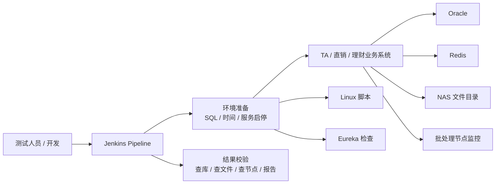

# TA 自动化测试项目技术方案详解

如果你只想看一份最完整、最适合面试复习的材料，优先看：

`TA自动化测试_面试总纲.md`

这份笔记专门解决一个问题：

`你是这个项目的业务提出方，不是底层实现者，未来面试时如何把它讲清楚、讲专业，但又不装成自己写了全部代码。`

这份内容基于：

- `工作后的开发项目/TA自动化测试/` 目录下的操作手册照片
- 对金融 TA 跑批场景的工程化反推

因此这里的目标不是“还原 100% 源码实现”，而是：

- 帮你理解这套系统大概率是怎么设计的
- 帮你知道每一层技术在解决什么问题
- 帮你建立一套面试里能讲的、可信的技术认知

---

## 一、先讲结论：这个项目本质上是什么

这不是普通意义上的“接口自动化测试”或者“页面自动化测试”。

它更接近：

`围绕 TA 与代销商之间核心文件交互和批处理链路做的场景化自动化回归方案。`

更准确地说，这个项目要解决的是：

- `TA` 作为理财对客层面的中转核心系统
- 既承担产品要素录入与分发
- 也承担客户账户、交易、份额和确认数据处理
- 每次版本升级后，必须确保“代销申请进来、TA 确认出去”这条核心闭环不被破坏

它解决的问题不是：

- 某个按钮点一下有没有反应

而是：

- 在一个特定交易日/账务日下
- 产品要素能不能从 TA 正确分发给代销商
- 开户、销户、申购、赎回等申请数据能不能从代销商正确回到 TA
- TA 的确认、份额、净值和收益数据能不能按批次再回传给代销商
- 跑通后数据库、缓存、文件、批处理节点状态是不是都正确

所以这类项目的核心难点是：

`业务流程很长，依赖的系统很多，人工回归成本极高。`

---

## 一点五、先把 TA 在这个项目里的业务定位讲清楚

你可以把 TA 理解成理财对客层面的“中转与处理中心”：

- 在产品管理系统上线前，TA 本身还是产品要素录入入口
- TA 会把产品要素通过批处理分发给各家代销商
- 代销商再在各自 App 或渠道中售卖
- 第二天，代销商会把客户开户、销户、申购、赎回等申请数据发给 TA
- TA 对这些申请做确认、份额计算、净值处理
- 再把确认数据、收益率数据、净值数据回传给代销商

所以从业务价值上讲，这个项目自动化验证的其实不是零散功能，而是：

`代销商 <-> TA 之间最核心的数据交互闭环。`

---

## 二、为什么这个项目需要自动化

如果手工做一遍 TA 场景回归，往往不是只点几个页面，而是要做一整套准备：

1. 先把测试环境调到某个可跑批的状态
2. 改日期参数
3. 清理旧数据
4. 重启部分服务
5. 确认注册中心恢复正常
6. 跑某个业务场景
7. 看数据库结果
8. 看缓存有没有刷新
9. 看文件有没有生成
10. 看节点有没有报错
11. 出了问题还要再修环境、重跑

这件事如果每次都人工做，会有几个问题：

- 很慢
- 很容易漏步骤
- 不同人执行结果不一致
- 每次升级切换都要重复劳动

所以自动化的目标就是：

`把“代销申请进入 TA、TA 处理后再把确认结果返回代销商”这条核心闭环的高频回归动作，固化成一条可反复执行的测试链路。`

---

## 三、你可以把它理解成一条“自动化跑批流水线”

最容易理解的方式，是把它拆成 5 层。

### 第 1 层：触发层

这一层大概率就是 `Jenkins Pipeline`。

手册里已经很明确出现了：

- Jenkins
- Build with Parameters
- 场景案例跑批
- 不同环境选择

说明这套方案不是测试人员本地跑个脚本，而是：

- 有统一入口
- 有环境参数
- 有任务记录
- 有执行结果

你可以把 Jenkins 理解成：

`“自动化测试总控台”`

它负责：

- 让测试场景可以一键触发
- 让不同环境执行方式统一
- 让任务执行有记录、有报告

---

### 第 2 层：环境准备层

这是这类项目最关键的一层。

因为 TA 场景往往不能直接跑，必须先把环境准备到特定状态。

手册里已经能看到的动作包括：

- 执行 SQL
- 改系统日期相关参数
- 切换 Linux 服务器时间
- stopwas / startwas 启停服务
- 检查 Eureka 注册
- 清理自动化中间表

这说明环境准备层大概率负责这些事情：

#### 1. 数据初始化

比如：

- 清掉上一次案例残留数据
- 重置产品状态
- 重置交易日期
- 重置参数开关

为什么需要它？

因为如果上一次测试残留的数据不清掉，这一次跑出来的结果就可能不可信。

#### 2. 时间控制

TA 跑批高度依赖时间。

比如：

- T0
- 日终
- 夜市
- 次日启机

这些流程本质上都和“当前环境认为现在是什么时间”有关。

所以系统要么：

- 改参数里的交易日
- 要么直接切服务器时间

这就是你在手册里看到“改到前一天 10:00”“切到当天 20:00”这类操作的原因。

#### 3. 服务状态重建

改完时间或数据以后，服务未必立刻生效。

所以会有：

- `stopwas`
- `startwas`
- 重新确认服务是否注册到 `Eureka`

这里的核心是：

`让环境回到一个可执行测试的稳定状态。`

---

### 第 3 层：场景执行层

这一层就是具体跑哪些业务场景。

从手册看，已经覆盖了非常典型的业务流程：

- T0 创建产品
- 参数下发
- 创建客户
- 资金兑入
- 购买产品
- 风险评估过期处理
- 直销日终
- TA 日终净值
- TA 日终跑批
- 夜市
- 次日日启

这说明自动化不是按“接口 A、接口 B”切，而是按：

`业务场景`

来组织的。

为什么这很重要？

因为金融系统测试里最值钱的通常不是“接口单测”，而是：

`一条完整业务链路是否通。`

也就是说，它测试的不是一个点，而是从“产品分发”到“申请接收”再到“确认回传”的一串点。

---

### 第 4 层：结果校验层

这套系统最有技术含量的地方，很可能就在这里。

因为它不是只看 Jenkins 显示绿色就结束。

手册里能看出来，结果判断至少来自 4 类信息：

#### 1. 数据库校验

比如查：

- 产品状态
- 交易请求状态
- 用户权限
- 参数值
- 中间表数据

为什么查库？

因为批处理很多结果最终要落到库里，数据库是最直接的事实来源。

#### 2. 缓存校验

手册里出现了 Redis。

这说明有些业务动作完成后，不仅数据库要对，缓存里也要有正确状态。

否则会出现：

- 页面不刷新
- 参数没生效
- 系统行为和库里状态不一致

#### 3. 文件校验

手册里多次提到：

- 查看 NAS 目录
- 看文件是否生成
- 看文件时间

这在批处理系统里非常典型。

因为很多日终、夜市、清算链路都依赖文件交换。

所以有时候“业务成功”的定义不仅是数据库写成功，还包括：

- 某个批量文件真的生成了
- 生成时间也符合预期

在这个项目里，这一点尤其重要，因为自动化本身就是在模拟：

- 代销商向 TA 发送申请文件
- TA 处理后返回确认文件

#### 4. 节点监控 / 报错详情

手册里多次出现批处理节点图、预警信息页、错误弹窗。

这说明当场景失败时，系统不是只看“任务失败”，而是会进一步定位：

- 卡在哪个节点
- 错误码是什么
- 是时间不对、数据不对，还是文件不对

这也是为什么我之前判断：

`它更像一套工程化的场景验证体系，而不是单一测试脚本。`

---

### 第 5 层：异常修复与重试层

从手册看，这套系统并不是完全无人值守。

它明显保留了一些人工处理动作，比如：

- 修改参数后再刷新缓存
- 解锁用户
- 修复文件日期
- 调整控制位
- 再次执行某个节点

这说明系统设计上很可能遵循的是：

`高频步骤自动化，异常场景可修复，修复后可重试。`

这其实是很现实、也很成熟的做法。

因为金融测试环境里，很多复杂场景很难做到完全黑盒无人参与。

---

## 四、你可以怎么理解它的技术架构

用一句话概括：

`Jenkins 负责编排，SQL 负责准备和校验，Linux 负责环境控制，业务系统负责执行，文件交互/监控/缓存负责辅助断言。`

你可以把它画成这样：

每一层的职责如下：

- `Jenkins`
  - 统一触发和记录

- `Oracle SQL`
  - 做环境初始化和结果验证

- `Linux 脚本`
  - 做服务启停和时点控制

- `业务系统`
  - 真正执行场景

- `Redis / 文件 / 监控页`
  - 提供更完整的结果判断依据

---

## 五、从业务提出方角度，你最该理解的技术点

你未来面试不需要装成自己写了每个脚本，但你最好把下面这些讲明白。

### 1. 为什么要用 Jenkins

因为要把高频测试场景做成：

- 可重复执行
- 可参数化
- 可记录
- 可回看结果

如果不用 Jenkins，而靠人工一个个脚本跑：

- 不标准
- 不方便复用
- 也不方便在升级切换时统一执行

---

### 2. 为什么离不开 SQL

因为 TA 批处理类测试很多时候必须直接控制底层状态。

比如：

- 改交易日
- 改产品状态
- 清中间表
- 改参数开关
- 校验结果

这些事情如果都通过页面操作做，会非常慢，而且不稳定。

所以 SQL 在这里不是“补充工具”，而是核心手段之一。

---

### 3. 为什么还要看缓存和文件

因为数据库对了，不代表整个链路真对了。

金融批处理场景里经常会出现：

- 库里改了，但缓存没刷新
- 库里有了，但文件没生成
- 业务成功一半，节点后面卡住了
- 申请文件来了，但确认文件没正常返回

所以真正可靠的自动化验证，一定不是只看库。

---

### 4. 为什么会有“服务启停、Eureka 检查、时间切换”

因为这类系统不是简单 CRUD 系统，它有明显的：

- 时点依赖
- 批处理依赖
- 多服务协同依赖

如果时间状态不对、服务没完全恢复、实例没注册成功，后面业务跑批就会出很多假失败。

---

## 六、如果面试官问“这套方案大概是怎么实现的”

你可以这样答：

“从我对项目的理解看，这套自动化不是简单的页面回放，而是围绕代销商和 TA 之间核心文件交互做的场景化批处理自动化。它大概率是以 Jenkins 作为统一执行入口，把不同环境和业务场景参数化；前置阶段通过 Oracle SQL 和 Linux 脚本完成数据初始化、日期调整、服务启停和环境恢复；执行阶段模拟产品分发、申请进入 TA、确认结果回传等关键链路；结果阶段再结合查库、查缓存、查文件和批节点状态来判断是否通过。它的重点不只是自动执行，而是把 TA 每次升级后最核心的对客闭环验证标准化。” 

这段话对你是安全的，因为它是在讲：

- 你理解的方案
- 不是在 claim 你写了全部实现

---

## 七、如果面试官问“你作为业务提出方，起了什么作用”

这个问题你要答得非常稳。

推荐说法：

“我在这个项目里更偏业务提出方和场景定义方。因为我更熟悉 TA 场景里哪些链路最值得做自动化，哪些步骤最耗人工、最容易出错，哪些校验点对业务最关键。所以我主要贡献在于，把业务上高频、复杂、可标准化的场景梳理出来，推动形成一套可重复执行的自动化验证流程。技术实现细节我没有全部亲自写，但我理解这套方案背后的实现逻辑和它为什么这么设计。” 

这句话很重要。

它既保住真实性，也体现你的价值。

---

## 八、你面试时不要讲太满的地方

不要直接说：

- “这个框架是我搭的”
- “底层是我写的 Jenkinsfile”
- “底层一定是 TestNG / Selenium / Cucumber”
- “我实现了所有 SQL 和脚本”

更稳的说法是：

- “从手册和使用过程看，这套方案是这样设计的”
- “我参与较多的是场景梳理和业务验证逻辑”
- “技术实现我不是主开发，但我理解它的整体设计”

---

## 九、你最该掌握的面试版认知

未来你讲这个项目时，最重要的不是框架名，而是这 5 个理解：

1. 这是 `批处理场景自动化`，不是普通 UI 自动化
2. 难点在于 `时间、状态、服务、文件、节点` 联动
3. Jenkins 是 `执行入口`
4. SQL 是 `环境准备和结果校验核心手段`
5. 最终目标是把 `高频复杂回归链路标准化`

---

## 十、最短背诵版

“这个项目我更多是业务提出方。我的理解是，它本质上是一套围绕 TA 和代销商之间核心文件交互做的场景化自动化回归方案。前面通过 Jenkins 统一触发场景，结合 SQL、服务启停和日期调整做环境准备，中间模拟申请文件进入 TA、确认文件返回代销商这类关键业务链路，后面再通过数据库、缓存、文件和批节点状态做联合校验。它解决的是 TA 每次升级后，最核心对客闭环手工回归成本高、步骤分散、排障慢的问题。” 
