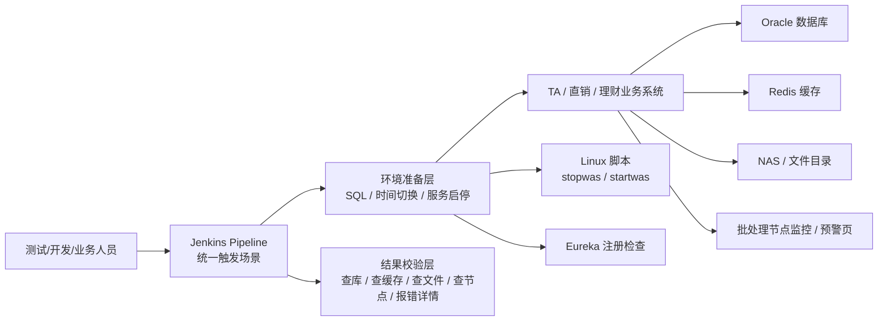

# TA 自动化测试项目面试总纲

这份笔记是你讲这个项目时最该看的主文件。

目标只有两个：

1. 让你真正知道这个工具 `做了什么、为什么重要、用了什么技术、整体架构是什么`
2. 让你在面试里能把这个项目 `讲清楚、讲稳、扛得住追问`

这份总纲基于两类信息整理：

- 你亲自补充的业务背景
- `工作后的开发项目/TA自动化测试/` 里的自动化跑批手册照片

注意边界：

- 你是这个项目的 `业务提出方 / 场景设计方 / 推动与验收方`
- 你不是底层唯一编码实现者
- 所以你要讲的是 `项目本质、方案逻辑、技术理解、你的真实价值`
- 不要把自己包装成“底层脚本全是我写的”

---

## 一、先用最短的话讲清这个项目

### 一句话版本

`这是一个围绕 TA 与代销商之间核心申请/确认文件交互闭环做的场景化自动化回归工具，用来保证 TA 每次版本升级后，最核心的对客功能链路不出问题。`

### 两句话版本

`TA 是理财对客层面的核心中转系统，既负责产品要素分发，也负责客户账户、交易申请、份额确认和净值结果回传。这个自动化工具的目的，是模拟代销商和 TA 之间申请文件进入、确认文件返回的关键交互过程，验证 TA 升级后核心功能链路仍然稳定可用。`

---

## 二、你必须先讲明白 TA 到底是什么

这是面试里最容易被忽略、但最能拉开差距的一步。

你不要上来就说“这是一个自动化测试工具”。

你要先说：

### TA 的业务定位

在你的业务里，`TA` 可以理解成理财对客层面的核心中转与处理系统。

它承担几类关键职责：

- 产品要素录入与管理
- 产品要素向代销商分发
- 客户账户维度管理
- 交易申请管理
- 份额管理与确认
- 净值、收益率、确认结果回传

### 在产品管理系统上线前的特殊背景

在产品管理系统正式上线前：

- `TA` 本身还是产品要素的录入入口
- 产品要素先录进 TA
- TA 再通过批处理把产品信息分发给各家代销商

### 代销商与 TA 的交互闭环

大体流程是：

1. TA 把产品信息按批次下发给代销商
2. 代销商在各自 App / 渠道售卖
3. 第二天代销商把客户开户、销户、申购、赎回等申请发回 TA
4. TA 对这些申请做确认、份额计算、净值处理
5. TA 再在批后把确认数据、净值数据、收益数据回传给代销商

所以这个项目真正验证的是：

`代销商 -> TA -> 代销商`

这条最核心的数据交互闭环。

---

## 三、这个工具到底做了什么

## 1. 它不是一个“简单点页面”的工具

它不是只做这些事情：

- 登录系统
- 点几个按钮
- 看页面有没有报错

它真正做的是：

- 准备测试环境
- 构造或清理关键数据
- 触发特定业务场景
- 模拟申请文件和确认文件的交互
- 检查库表状态、缓存状态、文件结果、批处理节点
- 失败时定位问题在哪一层

所以它更像：

`一套围绕 TA 核心业务闭环做的场景化自动化回归方案`

而不是一个单点测试脚本。

## 2. 它覆盖哪些业务场景

从操作手册可以明确看出，这个工具覆盖了很多关键场景，例如：

- T0 创建产品
- T0 参数下发
- 直销空跑
- T0 直销产品参数设置
- T0 创建客户
- T0 购买资金兑入
- 机构客户风险评估过期处理
- T0 购买产品
- 直销日终跑批
- TA 日终净值
- TA 日终跑批
- TATO 跑批和夜市跑批
- 直销日启

你可以把它们理解成几类：

- `产品分发类`
- `客户与交易申请类`
- `确认与净值处理类`
- `日终/夜市批处理类`
- `版本回归验证类`

## 3. 它解决了什么问题

如果没有这个工具，每次 TA 升级之后，要验证核心链路通常得人工做：

- 改日期
- 清数据
- 启停服务
- 跑批
- 查库
- 查文件
- 看节点
- 出问题再人工排

这会带来几个问题：

- 执行成本高
- 强依赖熟练测试人员经验
- 容易漏步骤
- 每次升级都要重复劳动

这个工具的价值就是：

- 把高频回归场景标准化
- 把关键验证动作固化下来
- 让升级后的核心闭环验证更稳定、更可重复

---

## 四、这个工具大概率是怎么工作的

你可以把它理解成 5 个阶段。

## 阶段 1：环境准备

这一阶段会做：

- 清理上次案例残留数据
- 重置产品状态、参数状态、交易日
- 必要时切换服务器时间
- 重启相关服务
- 检查服务是否重新注册正常

从手册能看到的痕迹包括：

- 大量 SQL
- `stopwas / startwas`
- 时间切换
- Eureka 注册检查

## 阶段 2：触发自动化场景

通过 `Jenkins Pipeline` 统一触发。

手册中明确出现了：

- `Build with Parameters`
- 环境参数选择
- `理财TA_场景案例跑批`

这说明工具不是本地随手跑脚本，而是有一个统一入口。

## 阶段 3：模拟关键业务链路

这一阶段的核心不是“接口调一下”这么简单，而是：

- 模拟产品信息分发
- 模拟代销商申请进入 TA
- 模拟 TA 处理和确认回传
- 跑日终、夜市等批处理链路

## 阶段 4：结果校验

结果不是只看 Jenkins 成功失败，而是做多通道校验：

- 查数据库
- 看 Redis 缓存状态
- 看 NAS / 文件目录是否生成对应文件
- 看文件时间是否正确
- 看批处理节点是否按预期通过
- 看预警信息和报错详情

## 阶段 5：异常定位与修复

如果失败，不是只说“任务挂了”，而是继续定位：

- 是日期问题
- 是参数问题
- 是服务没恢复
- 是文件没生成
- 是节点卡住
- 还是库表状态不一致

必要时还会：

- 解锁用户
- 修改参数
- 修复文件日期
- 重跑节点

所以这套东西更像：

`自动化执行 + 工程化排障`

---

## 五、你需要掌握的技术架构

下面这部分是你面试里最重要的技术理解，不要求你会写代码，但你要知道每一层在干什么。

## 1. Jenkins

角色：

- 自动化场景的统一入口
- 负责参数化执行
- 负责记录构建和结果

你可以把它理解成：

`自动化执行总控台`

## 2. Oracle SQL

角色：

- 环境初始化
- 产品/交易/参数状态重置
- 用户权限检查
- 中间表清理
- 结果查询和断言

这里的关键理解是：

`SQL 在这个项目里不是辅助，而是核心。`

因为这类批处理场景很多状态只能通过数据库层快速控制和验证。

## 3. Linux 脚本

角色：

- 服务启停
- 让日期切换或参数变化生效
- 环境恢复

你在手册里看到的 `stopwas / startwas` 就属于这一层。

## 4. Eureka

角色：

- 确认服务重启后实例是否恢复正常

这一步很重要，因为如果服务没恢复，后面很多失败其实是假失败。

## 5. Redis

角色：

- 校验部分业务状态或参数是否已经刷新到缓存

为什么不能只看数据库？

因为有时库里对了，但缓存没刷新，系统实际行为仍然会错。

## 6. NAS / 文件目录

角色：

- 检查申请文件、确认文件或批处理相关文件是否真的生成
- 看生成时间是否符合预期

这里很关键，因为你这个项目的核心之一就是：

`模拟并验证代销商与 TA 之间的文件交互闭环`

## 7. 批处理节点监控 / 预警页

角色：

- 看链路推进到哪一步
- 定位是哪个节点挂掉
- 查看报错详情

这也是为什么这个项目不是简单“点一下 Jenkins 看绿灯”。

## 8. 文件内容校验是不是也能自动做

这个问题非常关键。

答案分成两层：

### 从“技术上能不能”来说

`完全可以，而且成熟方案本来就应该这样做。`

因为如果这个项目只做到：

- 文件生成了
- 文件时间对了
- 节点通过了

但不去校验文件内容本身，
那验证其实是不完整的。

对于 TA 这类系统来说，更有价值的通常是：

1. 文件有没有生成
2. 生成的是不是正确文件
3. 文件里的关键字段对不对
4. 文件内容和数据库确认结果是否一致

也就是说，更完整的自动化应该包含：

- `文件存在性校验`
- `文件命名/时间校验`
- `文件结构校验`
- `文件关键字段校验`
- `文件内容与库表结果对账校验`

### 从“你现在手里的手册证据”来说

`我能高置信确认它做了文件存在和时间校验，但还不能 100% 断言手册已经明确展示了完整的文件内容逐字段自动校验页面。`

也就是说：

- `文件相关校验` 这件事肯定在做
- `内容级自动断言` 从技术上非常合理，也很可能是应有方向
- 但 `是否已经在统一结果看板里完整展示为红绿灯`，手册证据还不够

### 你现在最稳的理解

你可以这样理解这套方案：

- `TA 自身业务页面`
  - 负责录产品、查数据、看业务状态

- `TA 跑批/节点监控页面`
  - 负责看当前跑到哪个节点、节点是否报错

- `Jenkins Pipeline`
  - 负责统一触发自动化场景，并记录流水线执行结果

- `文件校验逻辑`
  - 很可能是流水线中的某个步骤
  - 至少会校验文件是否生成、时间是否正确
  - 更成熟的做法会继续校验文件关键内容并和数据库结果对账

所以你问的这个方向是对的：

`一个更完整的自动化工具，完全应该把确认文件内容校验纳入流水线步骤，而不是只让人肉眼看文件。`

### 面试里怎么说最稳

你可以这样说：

“我的理解是，TA 自身有业务页面和跑批监控页面，前者用于录入和查询业务数据，后者用于看批处理节点推进和报错。自动化工具本身更像由 Jenkins 统一触发的一套流水线。对文件这块，如果只看文件有没有生成，其实不够，所以更完整的自动化应该把确认文件的关键字段校验也纳入流水线，比如校验文件结构、关键字段和数据库结果是否一致。就我现在能确认的手册证据来看，文件生成和时间校验是明确有的，内容级自动校验从技术上非常合理，也很可能是应有方向，但我不会在没有证据的情况下把现状讲得太满。” 

---

## 六、哪些技术你可以讲，哪些别讲太满

## 可以稳讲的

- Jenkins Pipeline
- Oracle SQL
- Linux 服务启停
- Eureka 注册检查
- Redis 缓存校验
- 文件目录校验
- 批处理节点监控
- 场景化自动化回归
- 升级后的核心闭环验证

## 只能保守讲的

这些你可以说“从使用和手册痕迹看，大概率如此”，但别说死：

- 底层自动化主语言大概率是 `Java`
- 报告体系可能接了 `Cucumber`
- 内部实现更像 `Jenkins + Java 自动化 + SQL + Shell`

## 不要直接 claim 的

- “框架全是我写的”
- “Jenkinsfile 是我写的”
- “底层一定用的是 Selenium / TestNG / Playwright”
- “我主导实现了整套平台”

---

## 七、你在这个项目里的真实价值怎么讲

最稳的定位是：

`业务提出方 + 场景 owner + 落地推动者 + 验收 owner`

你可以说你做了这些事：

- 判断哪些 TA 核心链路最值得优先自动化
- 定义每个场景的前后置条件
- 定义每个场景的关键校验点
- 推动开发和测试把场景落下来
- 用业务视角验收自动化结果是否真正可用

这其实非常有价值，因为这种项目最难的地方往往不是“怎么写一行脚本”，而是：

`哪些东西必须测、怎么测才算真的测到了、什么结果才算真通过。`

---

## 八、面试时怎么介绍这个项目

## 1. 30 秒版本

“这个项目是围绕 TA 与代销商之间核心申请/确认文件交互闭环做的自动化回归工具。因为 TA 既承担产品要素分发，也承担客户账户、交易申请、份额确认和净值结果回传，所以每次升级都必须保证最核心对客链路没问题。我主要负责把这些高频场景拆成可自动化验证的流程，定义前后置条件和关键校验点，再协同开发测试同事推进落地。” 

## 2. 1 分钟版本

“TA 自动化测试这个项目，本质上不是普通接口或页面自动化，而是围绕 TA 和代销商之间核心文件交互闭环做的场景化回归方案。TA 在我们体系里既是产品要素分发中心，也是客户账户、交易、份额、确认和净值处理中心，所以每次版本升级后，最关键的是保证‘代销申请能正常进来、TA 确认结果能正常回去’这条闭环不被破坏。  
我在这个项目里更偏业务提出方和场景 owner，主要做的是梳理哪些高频场景最值得做自动化，比如产品分发、开户销户、申购赎回申请进入 TA、确认回传、净值下发、日终夜市等，并把每个场景拆成前置条件、执行步骤和关键校验点。技术上，这套方案是通过 Jenkins 统一触发，前面用 SQL、日期调整和服务启停做环境准备，中间执行具体场景，后面再通过查库、查缓存、查文件和看批节点状态做联合校验。” 

## 3. 2 分钟版本

“这个项目对我来说，核心不是测试工具本身，而是把 TA 最重要的对客闭环工程化验证。因为在产品管理系统上线前，TA 本身还是产品要素录入入口，它会把产品要素通过批处理分发给代销商；之后代销商又会把客户开户、销户、申购、赎回等申请发回 TA，TA 再做确认、份额计算、净值处理，并把确认和净值数据回传出去。  
所以 TA 每次版本升级后，真正要验证的不是某个单点页面，而是这条代销商和 TA 之间最核心的数据交互闭环是否仍然稳定。手工做这类回归成本很高，因为要改日期、清数据、重启服务、跑批、查库、查文件、看节点，出了问题还要再排障。  
我在项目里主要负责从业务侧把最值得做自动化的场景梳理出来，并把它们拆成前后置条件、执行动作和关键校验点，再协同开发和测试同事推进成可重复执行的自动化案例。技术上，我理解这套方案是以 Jenkins 作为统一入口，结合 Oracle SQL、Linux 服务启停、缓存和文件校验、批处理节点监控来实现的。它的价值在于，把原本分散、依赖经验的核心回归链路标准化了，能更稳地支撑版本回归和升级切换。” 

---

## 九、面试官最可能问什么，以及你怎么答

## 0. 这个项目是不是有页面？是不是点一下就自动跑完看红绿灯？

推荐理解：

- `有页面`
- 但不一定是“一个专门自研的大一统测试平台页面”
- 更像是 `Jenkins 执行页面 + 业务系统页面 + 批处理监控/预警页面` 的组合

从操作手册能高置信确认看到：

- `Jenkins Pipeline` 页面
- 环境选择和 `Build with Parameters`
- 业务系统页面
- 批处理节点监控 / 预警信息页面

所以比较稳的判断是：

1. 测试人员会先在 Jenkins 页面选择环境、启动某个自动化场景
2. 系统会自动执行一整套预设流程
3. 执行过程中或执行后，会通过 Jenkins 结果、批节点状态、预警信息、数据库/文件检查等方式判断是否通过

所以答案是：

- `是有页面的`
- `也确实能通过平台触发自动执行`
- 但 `结果呈现不一定只是一个页面上所有测试点整齐地亮红绿灯`

更准确的说法是：

`它更像“由 Jenkins 触发自动执行，再结合节点监控、预警页面和查库查文件完成结果判断”的半平台化方案。`

如果面试官问到这个，你可以答：

“从我接触和手册内容看，这个项目是有页面的，但更准确地说，是由 Jenkins 承担统一触发入口，测试人员在 Jenkins 上选环境、点执行后，系统会自动跑场景。跑完后除了看 Jenkins 任务成功失败，还会结合批处理节点监控、预警页面、数据库和文件结果综合判断是否通过，所以不完全是一个单页面红绿灯看板。” 

## 1. 这个工具到底测什么

推荐答法：

“它测的不是单点接口，而是 TA 和代销商之间最核心的数据交互闭环，包括产品分发、申请进入 TA、确认结果回传、净值处理以及日终夜市这类关键批处理链路。” 

## 2. 为什么这个项目值得做自动化

推荐答法：

“因为这条链路强依赖交易日、参数状态、服务状态、文件生成和批节点推进，手工回归非常重，而且每次升级都必须重复做。自动化能把高频核心场景固化下来，减少经验依赖，提高回归稳定性。” 

## 3. 这个工具用了什么技术

推荐答法：

“从我参与和使用的角度看，这套方案的核心技术层主要包括 Jenkins 作为统一触发入口，Oracle SQL 用于环境准备和结果校验，Linux 服务启停和时间切换用于环境控制，再结合 Redis、文件目录和批处理节点监控做联合校验。底层实现大概率是 Java 自动化配合脚本和 SQL，但这部分我不会讲得太满，因为我不是唯一底层实现者。” 

## 4. 为什么 SQL 在这个项目里这么重要

推荐答法：

“因为这类 TA 批处理场景很多关键状态只能在数据库层高效控制和验证，比如日期、产品状态、参数状态、中间表数据和交易请求结果。如果完全走页面，效率很低，也不稳定。” 

## 5. 为什么还要看文件和缓存

推荐答法：

“因为数据库对了，不代表闭环就真的对了。这个项目本质上要验证代销商和 TA 之间的文件交互，所以文件有没有生成、生成时间对不对，本身就是结果的一部分。缓存也是一样，库里对了但缓存没刷新，实际业务行为还是可能出错。” 

## 6. 这个项目最难的点是什么

推荐答法：

“最难的点不是单个测试脚本，而是把环境准备、场景执行、结果校验和异常定位串成一条稳定链路。因为这里同时依赖时间点、服务状态、参数状态、文件生成和批节点推进，少一个环节都可能造成假失败。” 

## 7. 你在这个项目里具体做了什么

推荐答法：

“我主要做的是场景梳理、规则拆解、推动落地和结果验收。比如明确哪些链路必须优先自动化、每个场景前置要改哪些参数、要不要切日期、最后查哪些表、看哪些文件、看哪个节点通过才算真的成功。” 

## 8. 所以你不是主要开发？

推荐答法：

“如果按底层编码实现来说，我不是唯一主开发；但如果从项目提出、场景定义、推动落地和验收责任来看，我参与很深。这个项目最关键的价值其实是把复杂 TA 场景拆清楚，明确哪些条件必须满足、哪些结果才算通过，这部分我承担得比较多。” 

## 9. 你为什么也懂技术方案

推荐答法：

“因为这个项目里，业务和技术强耦合。如果我不理解 Jenkins 是触发层、SQL 是环境准备和结果校验核心手段、文件和节点为什么必须校验，就很难把场景定义准确，也没法验收自动化是否真正可用。” 

---

## 十、如果面试官继续深挖技术，你怎么稳住

你可以用这个句型：

`从我参与项目推进和日常使用的角度看，这一层的作用是……`

比如：

- “从我参与项目推进和使用的角度看，Jenkins 主要承担统一触发和记录作用。”
- “从我理解，这里的 SQL 主要承担环境准备和结果校验。”
- “从手册和使用过程看，这套方案很强调文件校验，因为项目本身就是在验证申请和确认文件闭环。”

这样既显得你理解技术，也不会越界 claim 自己写了底层。

---

## 十一、哪些地方你要主动强调

你最值得强调的不是“我会不会写底层代码”，而是：

- 你懂 TA 核心业务闭环
- 你懂升级后最该守住哪条链路
- 你懂怎么把复杂业务抽象成可自动化验证的场景
- 你懂自动化方案为什么要用 Jenkins、SQL、文件校验、节点监控这些手段

这对金融开发岗其实很有价值。

---

## 十二、你不要说的话

不要说：

- “这套自动化平台就是我主开发的”
- “底层脚本和 Jenkins Pipeline 主要都是我写的”
- “具体框架细节我全都很熟”
- “底层一定就是某某框架”

一旦被追问，风险很高。

---

## 十三、最稳的收尾总结

“这个项目里，我不是单纯提需求的人，也不是底层唯一实现者。我更像是站在 TA 核心对客闭环和自动化落地之间的桥梁，负责把最重要、最复杂、最值得回归的链路定义出来，并推动形成一套可重复执行、可验证、可复用的自动化回归方案。” 
