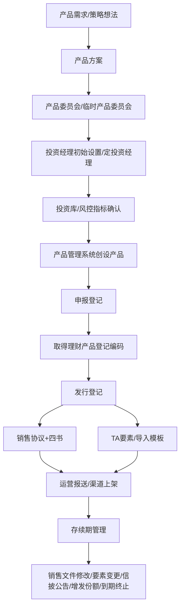

# 产品部全流程学习笔记

本笔记按产品部真实工作流程整理：从产品想法形成，到产品申报、发行、渠道上架，再到存续期管理。学习重点不是背文件名，而是理解产品部为什么要管这些流程、这些字段和这些材料。

## 1. 总流程图

一句话理解：产品部不是单点写材料，而是连接销售、投资、风险合规、运营、渠道和系统的流程中枢。

## 2. 产品方案

资料原文口径：产品方案通常围绕产品定位、目标客群、投资策略、资产投向、风险等级、收益测算等内容形成，是后续产品委员会和产品发行的业务基础。

我的理解总结：产品方案回答“这个产品为什么做、给谁做、怎么投、风险收益如何、公司是否具备承接能力”。它是产品部把销售需求和投资能力翻译成可落地产品的第一步。若涉及主题策略或特殊资产范围，还要同步考虑是否需要新建投资库、主题型投资库或调整风控指标。

产品部为什么关心：

- 产品方案决定后续说明书、风险评级、销售口径和渠道选择。
- 产品方案会影响申报材料、投资范围、业绩比较基准和风险等级。
- 产品方案是产品矩阵建设的起点，不能只从单只产品角度看。
- 产品方案还要前置判断投资库和风控指标能否承接，避免发行前才发现投资边界无法落地。

面试可用表达：

“我理解产品方案不是简单写一个产品介绍，而是把客户需求、渠道需求、投资策略、风险边界、投资库承接和公司产品矩阵结合起来，判断产品是否值得做、能不能合规做、后续能否顺畅发行和管理。”

## 3. 产品委员会

资料原文口径：产品委员会可分为定期产品委员会和临时产品委员会。定期会议偏市场、同业、公司产品发行情况复盘和计划讨论；临时会议偏新产品或新策略审批。

我的理解总结：产品委员会是产品部进行产品规划、产品方案审批和跨部门协同的重要机制。它不只是“审批会”，更是把市场需求、投资能力、销售反馈和风险边界汇总成产品供给的场景。

产品部为什么关心：

- 产品委员会决定某类产品或系列能不能做。
- 产品委员会材料能体现产品部对市场、同业和公司经营情况的理解。
- 竞聘时谈产品部业务发展，产品委员会是很好的切入点。

面试可用表达：

“产品委员会是产品部把市场判断、同业情况、销售反馈、投资能力和风险合规要求整合到一起的机制。定期产品委员会更偏规划和复盘，临时产品委员会更偏新产品或新策略落地审批。”

## 4. 投资经理初始设置/定投资经理

资料原文口径：新发产品一般需要先走投资经理初始设置与变更流程。流程表中简称“定投资经理”。产品部汇总产品信息，投资相关部门补充投资经理信息，集中交易室或相关条线提起投决会或会签流程，完成后进入系统创设和后续申报。

我的理解总结：这个流程解决的是“谁管理产品”和“产品如何进入投资系统链条”的问题。培训里的“定投”不要理解成基金定投，而是内部口语里的投资经理设置。

产品部为什么关心：

- 未完成投资经理设置，后续申报和系统录入容易卡住。
- 投资经理信息会进入申报登记、发行材料、报备人员信息等多个下游字段。
- 这是产品、投资、交易、运营之间的关键前置协同点。

面试可用表达：

“我把定投资经理理解为产品进入投资运作链条的前置流程。它明确产品主副投资经理，并通过内部审批和系统录入，把后续申报登记、发行登记和投资管理衔接起来。”

## 5. 产品管理系统创设

资料原文口径：定投资经理流程完成后，产品经理或专岗将共享文档内容导入产品管理系统。系统会校验投资经理、产品代码、报备人员信息、三级系列文档模板关联等要素。三级系列需关联申报登记说明书、发行登记说明书等文档模板，否则无法自动生成销售文件。

我的理解总结：产品管理系统是产品部从“手工材料制作”转向“要素化管理”的核心工具。产品创设不是简单建档，而是建立后续所有材料和流程的源头数据。

产品部为什么关心：

- 源头字段错，下游说明书、导入模板、TA 要素和信披材料可能一起错。
- 文档模板没关联，后续一键生成销售文件会失败。
- 系统规则和字段校验会直接影响产品部效率和差错率。

面试可用表达：

“产品管理系统的核心价值是把产品要素从文件里抽出来，形成结构化数据，再通过模板和流程生成销售文件、报送文件和下游系统要素。我在科技部对接产品部、参与筹建产品管理系统，因此不是单纯从系统角度看需求，而是能理解产品部为什么要做要素化、模板化、接口化，也理解源头字段、模板规则和接口联动对产品发行效率的影响。”

## 6. 申报登记

资料原文口径：申报登记的核心目标是向理财登记中心报送产品基础材料并取得理财产品登记编码。公募产品通常约 10 个工作日下编码，私募产品通常约 2 个工作日下编码，下编码当日可做发行登记。

申报登记常见前置事项：

| 前置事项 | 说明 |
|---|---|
| 定投资经理 | 一般先完成投资经理初始设置 |
| 流动性风险评估 | 仅针对开放式产品，封闭式产品不需要 |
| 风险评级表 | 由投资经理填写，参考风险等级评定细则 |
| 申报登记导入模板 | 按全国银行业理财信息登记系统数据元规范填写 |

申报登记常见材料：

| 材料 | 用途 |
|---|---|
| 可行性评估报告 | 说明产品设立背景、可行性、风险收益等 |
| 相关人员尽职调查报告 | 满足人员尽调和报备要求 |
| 销售协议及三书 | 三书为投资协议书、风险揭示书、投资者权益须知 |
| 产品说明书 | 产品基础条款和投资者信息披露核心文件 |
| 发行预告 | 申报阶段配套材料 |
| 流动性风险评估报告 | 主要针对开放式产品 |
| 申报登记导入模板 | 理财登结构化报送文件 |

我的理解总结：申报登记解决的是“产品是否取得监管/登记层面的基础编码”。它偏产品资格和基础信息报送，不是本次具体销售安排。

产品部为什么关心：

- 没有登记编码，后续发行登记和渠道上架无法继续。
- 申报版文件和发行版文件字段不同，产品部要知道哪些字段可留空，哪些字段必须准确。
- 公募和私募下编码时效不同，直接影响发行排期。

面试可用表达：

“申报登记更偏产品资格和基础信息报送，目标是取得理财产品登记编码。产品部要保证申报材料、导入模板和系统要素一致，同时考虑公募、私募下编码时效对发行排期的影响。”

## 7. 发行登记

资料原文口径：发行登记是取得登记编码后，将本次发行的募集时间、成立日、到期日、渠道、份额、费率等关键信息补齐，生成销售文件、TA 要素和相关导入模板。常规流程为 T 日起募、T-2 日做发行登记；加急流程为 T-1 日做发行登记，并要求去纸化流程在当天下午 15:00 前流转至运营部。

发行登记常见材料：

| 材料 | 说明 |
|---|---|
| 销售协议+四书 | 四书为产品说明书、投资协议书、风险揭示书、投资者权益须知 |
| 发行登记导入模板 | 理财登发行登记结构化报送 |
| 委托销售产品编码导入模板 | 涉及代销渠道和产品编码 |
| 产品变更登记批量导入模板 | 用于相关登记变更信息 |
| TA 要素表或产品要素导出表 | 给 TA 系统、运营和渠道使用 |

发行登记常见要素：

| 要素类别 | 典型字段 |
|---|---|
| 产品基础 | 产品名称、行内标识码、登记编码、理财产品代码 |
| 时间安排 | 募集起始日、募集结束日、成立日、到期日 |
| 销售安排 | 销售渠道、面向客群、销售区域、募集上限、渠道额度 |
| 份额安排 | 份额类型、销售代码、各份额发行规模上限 |
| 投资和收益 | 投资范围、业绩比较基准、产品风险等级 |
| 费用安排 | 固定管理费、销售服务费、托管费、浮动管理费、合同费率、执行费率 |

我的理解总结：发行登记解决的是“这一次产品怎么卖、谁来卖、卖多少、费用怎么收、渠道怎么上架”。

产品部为什么关心：

- 发行登记材料直接影响销售文件、理财登报送、TA 设置和渠道展示。
- 多份额、多渠道、多费率会显著增加一致性校验难度。
- 发行排期往往紧，产品部需要兼顾效率和准确性。

面试可用表达：

“发行登记是产品上架前最关键的落地环节。它把募集日期、成立到期、渠道、份额、费率和业绩比较基准等要素固化到销售文件、TA 要素和报送模板里，所以产品部要重点控制字段一致性和流程时效。”

## 8. 销售文件

资料原文口径：发行登记资料常用口径是“销售协议+四书”。四书包括产品说明书、投资协议书、风险揭示书、投资者权益须知。

销售文件结构：

| 文件 | 作用 |
|---|---|
| 产品说明书 | 说明产品条款、投资范围、费用、风险、估值、信披等，是最核心文件 |
| 投资协议书 | 明确投资者与管理人的权利义务 |
| 风险揭示书 | 揭示信用、市场、流动性、政策、估值等风险 |
| 投资者权益须知 | 告知投资者权利、信息披露、投诉渠道等 |
| 销售协议 | 与直销或代销渠道相关，可能使用公司模板或渠道个性化协议 |

我的理解总结：销售文件是给投资者和渠道看的“法律与产品说明文本”，TA 要素是给系统读的“结构化字段”。两者要一致，但服务对象不同。

产品部为什么关心：

- 产品说明书字段非常多，是最容易出错的文件。
- 代销渠道可能使用个性化销售协议，需要系统模板配置和渠道关联。
- 销售文件修改会牵涉信披公告、版本对比、报送和渠道更新。

面试可用表达：

“销售文件不是简单文本，它承载产品条款、风险揭示、费用规则和投资者权利义务。产品部既要保证内容合规，也要保证销售文件和 TA 要素、发行登记模板、渠道展示保持一致。”

## 9. TA 要素与产品管理系统

资料原文口径：TA 接口上线前，产品经理下载产品要素导出表，将信息粘贴到 TA 要素表格式转换模板，再提交 OA 去纸化流程给运营。TA 接口上线后，多数 TA 要素自动在系统间传输，但产品开放日信息、净值披露规则等文字型规则仍可能需要产品经理提交 OA 去纸化流程给运营设置。

TA 要素典型内容：

| 类别 | 字段示例 |
|---|---|
| 产品识别 | 产品代码、产品名称、登记编码、销售代码 |
| 时间规则 | 募集期、成立日、到期日、开放日、确认日 |
| 交易规则 | 起购金额、追加金额、申购赎回规则、巨额赎回比例 |
| 渠道规则 | 销售渠道、代销商额度、客户组 |
| 费用规则 | 固定管理费、销售服务费、托管费、浮动管理费 |
| 披露规则 | 净值披露频率、收益率披露频率、特殊披露日 |

我的理解总结：TA 要素是产品能否被系统正确销售、交易、清算和展示的关键字段集合。

产品部为什么关心：

- TA 要素错误会影响渠道上架、客户购买、额度控制、费用设置和披露。
- 接口上线减少手工转换，但也要求源头字段更准确。
- 文字型规则难以完全接口化，仍需人工流程和运营设置。

面试可用表达：

“TA 要素表是销售文件的结构化映射，也是产品进入系统和渠道的关键数据。系统化后，产品部更要把控源头字段质量，因为一个字段错误可能传导到多个下游系统。”

## 10. 费用、份额与计费基准

资料原文口径：产品费用常见包括销售服务费、固定管理费、托管费、浮动管理费、产品运作和清算中产生的其他费用、产品运营中发生的增值税及附加税费。多份额产品可能不同份额费率、业绩比较基准和浮动管理费规则不同。

费用字段学习表：

| 费用 | 学习重点 |
|---|---|
| 销售服务费 | 可能按产品或份额资产净值计提，与销售渠道和客户服务相关 |
| 固定管理费 | 管理人固定收取，可能分份额设置不同费率 |
| 托管费 | 托管机构费用，通常按资产净值计提 |
| 浮动管理费 | 与产品收益表现、业绩比较基准或阶梯规则相关 |
| 合同费率 | 说明书约定费率 |
| 执行费率 | 优惠后实际执行费率，不得高于合同费率 |

结合 3309 母子份额说明书，复杂计费基准可理解为：估值日产品或该份额扣除回购融资、产品运作及清算费用、增值税及附加税费后的资产净值。这个口径比“前一自然日产品总净值”更复杂，尤其适用于多份额产品。

产品部为什么关心：

- 费用字段会出现在说明书、系统费率模块、发行登记模板和 TA 要素中。
- 费率错误不仅影响材料，还可能影响客户收益、渠道展示和系统计提。
- 多份额产品下，份额维度的费率和业绩基准尤其容易混淆。

面试可用表达：

“费用字段是产品发行里非常典型的高风险字段。它既有合同约定，又有系统执行，还可能按份额区分。产品部要关注合同费率、执行费率、计费基准和生效日期，避免说明书、TA 和系统设置不一致。”

## 11. 封闭式与开放式差异

资料原文口径：流动性风险评估仅针对开放式产品，封闭式产品不需要。封闭式产品从成立到到期，中间通常没有持续开放申赎；开放式产品涉及申购赎回、开放期、渠道和存续期管理。

对比表：

| 维度 | 封闭式产品 | 开放式产品 |
|---|---|---|
| 客户资金 | 期限内相对锁定 | 按开放规则申购赎回 |
| 工作重心 | 发行前材料准确和排期管理 | 存续期持续运营和要素变更 |
| 流动性评估 | 通常不需要开放式流动性风险评估 | 需要关注流动性风险评估 |
| 存续期动作 | 相对少，更多关注到期、规模、数据 | 开放日、申赎、加渠道、改费率、公告披露 |
| 系统关注 | 募集、成立、到期、兑付 | 开放规则、确认日、披露规则、TA 设置 |

面试可用表达：

“封闭式产品更考验发行前的材料准确性和流程效率，开放式产品更考验存续期管理能力。产品部要根据产品运作方式配置不同流程、材料和系统规则。”

## 12. 风险评级与流动性风险评估

资料原文口径：风险评级表可对应“理财产品风险评估及评级意见审批单”，根据产品投资范围、资产配置、估值方法、信用风险、市场风险、流动性风险等形成产品风险等级。流动性风险评估主要针对开放式产品。

风险评级关注点：

| 维度 | 说明 |
|---|---|
| 信用风险 | 底层资产信用资质、评级、违约风险 |
| 市场风险 | 久期、估值方式、权益或商品暴露、价格波动 |
| 流动性风险 | 资产变现能力、开放式产品赎回压力 |
| 产品功能类型 | 现金管理、定开、固收等不同类型差异 |
| 投资比例 | 资产配置比例决定风险暴露 |

产品部为什么关心：

- 风险等级影响销售适当性和目标客群。
- 风险评级材料是申报流程的重要组成。
- 风险评级口径需要和产品说明书投资范围、资产比例一致。

面试可用表达：

“风险评级不是单独填表，而是产品条款、资产配置、估值方式和销售适当性的连接点。产品部要确保风险评级、说明书、销售对象和渠道准入口径一致。”

## 13. 投资库与风险管控

资料原文口径：理财产品发行需结合投资库管理与风险管控流程。投资库分为常规投资库和主题型投资库。非主题型产品通常适用常规投资库，主题型产品应基于常规投资库建立对应主题投资库。产品发行前，主投资经理需与风险合规确认适用投资库、是否需新建投资库或主题投资库、风险指标、投资库内投资比例、计算规则、监控开始时间和超限处置安排。

我的理解总结：这条线回答的是“产品发行后到底能按什么边界投、风险合规如何监控”。产品部不能只看产品能不能卖，还要在产品方案、产品委员会、申报和发行排期中，把投资库和风控指标作为前置条件管理。

产品部为什么关心：

- 如果主题投资库或风控指标未明确，主题产品即便材料写好了，也可能卡在投决会、风险合规或发行去纸化环节。
- 投资库范围会反向影响说明书投资范围、风险评级、产品方案和销售口径。
- 风险合规确认、投决会审议、投资库落地和发行登记存在先后关系，产品部要把这些节点纳入发行排期。

面试可用表达：

“产品拓展不能只看策略卖点，还要看投资库和风控指标能否承接。尤其主题型产品，需要在产品方案阶段就判断是否需要主题投资库、哪些风险指标要监控、投决会和风险合规审批如何衔接，避免到发行登记前才发现风险管控条件没有落地。”

## 14. 渠道上架

资料原文口径：发行登记完成后，销售文件、导入模板、委托销售编码、TA 要素等材料将支撑运营报送和代销渠道上架。渠道可能使用公司通用协议，也可能使用个性化销售协议。

我的理解总结：渠道上架是产品部前期所有字段和材料是否准确的最终检验。渠道看到的是产品展示和销售规则，背后依赖说明书、TA 要素、额度、费率、客户组和销售协议。

产品部为什么关心：

- 渠道上架失败会直接影响募集窗口和销售目标。
- 每增加一个代销渠道，可能增加协议、编码、额度和销售规则维护。
- 多渠道销售时，要特别关注销售文件和渠道展示口径一致。

面试可用表达：

“渠道上架不是销售端单独完成的事情，它依赖产品部前期把销售文件、TA 要素、委托销售编码、额度和协议模板准备准确。产品部要从渠道可承接角度倒推材料和系统字段质量。”

## 15. 存续期管理

资料原文口径：产品管理系统中存续期相关流程包括销售文件管理流程、要素变更流程、信披公告管理流程、估值条款涉及变更流程。存续期还可能涉及募集期修改、存续期修改、增发份额、渠道新增或删除、TA 要素修改、销售文件更新时间、报送和信披接口等。

常见存续期事项：

| 事项 | 产品部关注点 |
|---|---|
| 销售文件修改 | 是否涉及公告，是否需要领导审批，是否更新四书 |
| 要素变更 | 是否影响理财登、TA、渠道、信披 |
| 申报要素修改 | 涉及理财登申报字段时，需按申报要素修改单和说明书修订口径处理 |
| 发行要素修改 | 涉及发行登记字段时，需填发行登记要素修改表并同步运营 |
| 信披公告 | 公告标题和内容需与修改事项一致 |
| 增发份额 | 份额类型、销售代码、费率、业绩基准、渠道额度 |
| 渠道新增或删除 | 销售协议、委托销售编码、TA 额度 |
| 到期或终止 | 是否涉及销售文件更新、兑付安排、公告披露 |

产品部为什么关心：

- 开放式产品和多份额产品存续期动作频繁，流程边界复杂。
- 存续期修改不仅改系统，还可能触发信披、渠道和理财登报送。
- 版本管理和历史对比是降低错改、漏改的重要抓手。

面试可用表达：

“产品部的价值不止在新发产品，存续期管理同样重要。尤其是开放式、多份额、多渠道产品，任何要素变更都可能牵动销售文件、TA、信披、渠道和理财登，因此需要清晰的流程边界和系统留痕。”

## 16. 产品部核心价值总结

资料原文口径可以归纳为：产品部贯穿产品方案、产品委员会、投资库/风控指标确认、申报登记、发行登记、销售文件、TA 要素、渠道上架和存续期管理。

我的理解总结：产品部的核心价值是把复杂产品从“业务想法”变成“可销售、可报送、可系统承接、可风险监控、可持续管理”的标准化产品。

面试总表达：

“我理解产品部是理财产品全生命周期的流程中枢和要素中枢。它既要懂客户和渠道，也要懂投资策略、投资库和风险边界，还要懂理财登、TA、信披和产品管理系统。我在科技部对接产品部并参与筹建产品管理系统，对产品部从手工材料制作向要素化、系统化转型的痛点有直接体会。因此我可以从字段标准化、流程线上化、模板自动化、接口联动、校验前置和风险条件前置角度，帮助产品部降低差错率、提升发行效率，把复杂流程沉淀成可复用机制。”
