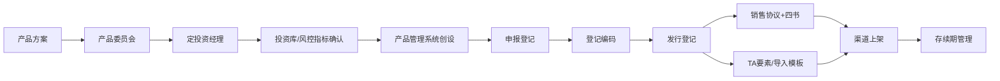

# 一页纸速记

面试前优先背这一页。核心目标：说清产品部做什么、流程怎么走、你能贡献什么。

## 1. 产品部一句话

产品部是理财产品全生命周期的流程中枢和要素中枢，把销售需求、投资策略、风险合规、运营报送、渠道上架和系统能力整合成可销售、可报送、可风险监控、可持续管理的产品。

## 2. 主流程

## 3. 十个必须说准的词

| 术语 | 速记 |
|---|---|
| 定投资经理 | 投资经理初始设置流程，不是基金定投 |
| 申报登记 | 向理财登记中心取得理财产品登记编码 |
| 发行登记 | 补齐本次募集、成立、渠道、份额、费率等发行要素 |
| 销售协议+四书 | 四书为说明书、投资协议书、风险揭示书、投资者权益须知 |
| TA 要素表 | 给系统、运营和渠道读的结构化字段 |
| 去纸化审批 | 内部线上审批、运营处理和归档留痕 |
| 风险评级表 | 理财产品风险评估及评级意见审批单，形成产品风险等级 |
| 投资库/主题投资库 | 产品投资运作和风险监控能否承接的前置边界 |
| 理财登数据元 | 申报、发行和募集期信息的监管结构化字段 |
| 申报/发行要素修改 | 先判断改的是申报字段还是发行字段，再同步文件、TA、渠道和运营 |

## 4. 申报登记 vs 发行登记

| 对比 | 申报登记 | 发行登记 |
|---|---|---|
| 核心目标 | 取得登记编码 | 完成本次销售上架准备 |
| 重点材料 | 可行性评估、尽调、说明书、销售协议及三书、发行预告、风险评级、流动性风险评估 |
| 重点要素 | 产品基础信息、投资范围、风险等级 | 募集期、成立日、到期日、份额、渠道、费率、业绩比较基准 |
| 时效 | 公募约 10 个工作日，私募约 2 个工作日 | 常规 T-2，紧急 T-1 |

## 5. 封闭式 vs 开放式

| 对比 | 封闭式 | 开放式 |
|---|---|---|
| 工作重心 | 发行前材料准确和排期 | 存续期持续运营 |
| 客户资金 | 期限内相对锁定 | 按开放规则申赎 |
| 流动性评估 | 通常不需要 | 需要重点关注 |
| 存续期动作 | 相对少 | 开放日、申赎、渠道、费率、信披、TA 规则 |

## 6. 流程优化四句话

1. 字段标准化：把说明书、TA、发行登记模板、渠道材料中的重复字段统一成单一数据源。
2. 校验前置化：把费率、日期、份额、渠道、材料完整性等高风险点放到系统填报阶段校验。
3. 接口和模板自动化：通过产品管理系统、文档模板、TA 接口和信披接口减少手工复制和人工核对。
4. 风险条件前置化：把投资库、主题投资库、风控指标和投决会条件纳入产品发行排期。

## 7. 产品管理系统筹建背景怎么转成优势

| 过往经历 | 产品部价值 |
|---|---|
| 对接产品部 | 已经熟悉产品部流程痛点，不是从零开始 |
| 筹建产品管理系统 | 理解产品创设、申报发行、文件生成、产品要素导出、TA 接口等系统链路 |
| 需求分析 | 能把复杂流程拆成场景、角色、字段和规则 |
| 系统设计 | 能推动模板生成、接口联动、权限控制和校验前置 |
| 跨部门协同 | 能连接产品、销售、投资、风险、运营和科技 |
| 数据意识 | 能沉淀发行规模、起息量、到期量、净增量和渠道表现 |

## 8. 2 分钟回答

“我理解产品部不是简单做材料，而是理财产品全生命周期的流程中枢和要素中枢。一只产品从方案到上架，要经过产品方案、产品委员会、投资经理初始设置、投资库和风控指标确认、产品管理系统创设、申报登记、发行登记、销售文件和 TA 要素下发、渠道上架以及存续期管理。过程中，产品部要把销售需求、投资策略、风险合规、理财登报送、TA 和信披系统串起来。我在科技部一直对接产品部，并参与筹建产品管理系统，所以对产品部从手工材料制作走向要素化、系统化的痛点有直接体会。如果进入产品部，我希望把这段系统建设经验和产品业务结合，帮助提升发行效率、降低材料差错，并把复杂流程沉淀成可复用机制。”
