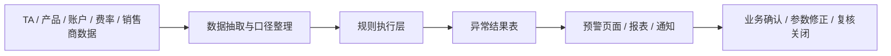

# TA 批前预警稽核平台：项目讲法

## 一句话定位

这是围绕 `TA 夜间跑批 / 清算前检查` 建设的前置稽核能力，把交易规模、产品状态、账户、费率、开放期等检查规则沉淀成可执行校验项，在正式跑批前提前暴露问题。

它不是普通看板，也不是系统监控，而是 `业务规则校验 + 运营风险前置控制`。

## 30 秒讲法

“TA 批前预警稽核平台主要解决的是 TA 夜间批处理前关键检查依赖人工的问题。它分成两类能力：一类是恒生 AOP 侧更偏交易类的批前预警，比如基于当前产品份额和新申购规模检查募集规模、销售额度、持有限额等；另一类是我们团队自研的静态参数稽核，比如检查托管账号、销售商清算账号、费率、开放期、日期、产品状态等参数是否漏设或错设。我主要参与需求讨论、稽核规则梳理、检查口径定义和落地验证，核心价值是把后台运营控制从人工经验检查推进到规则化、系统化的批前识别。”

## 两类检查能力

| 类型 | 触发时点 | 检查对象 | 典型问题 | 价值 |
| --- | --- | --- | --- | --- |
| 交易类批前预警 | 跑批前 | 份额、申购规模、交易申请、销售控制 | 超募集规模、超销售额度、超持有限额、成立条件不满足 | 避免交易确认或清算阶段才暴露规模类问题 |
| 静态参数稽核 | 日常或跑批前 | 账户、费率、开放期、日期、产品状态、销售关系 | 参数漏设、错设、状态冲突、日期不一致 | 避免配置问题进入夜间批处理链路 |

更准确的表达是：`恒生 AOP 承接交易类批前预警，团队自研补足静态参数稽核`。这能体现你知道哪些能力来自厂商，哪些能力来自内部团队。

## 业务背景

TA 系统的夜间批处理会串起申请读入、交易确认、份额登记、资金清算、文件生成等关键动作。前置数据或参数一旦有问题，常见后果是：

- 跑批中断，夜间窗口被压缩。
- 交易确认结果异常，需要临时排查。
- 清算数据不一致，影响销售商、托管行或内部运营。
- 问题定位依赖人工经验，处理链路长。

因此这个项目的核心不是“多一个页面”，而是把高风险检查点前移到跑批前，让问题在可处理时间窗口内暴露。

## 技术理解

| 模块 | 技术含义 | 面试表达 |
| --- | --- | --- |
| 数据抽取 | 从 TA、产品、账户、费率等数据源取数 | 先保证检查数据口径稳定 |
| 规则执行 | 将稽核项转成 SQL、代码规则或配置化规则 | 核心是规则系统化，不是人工肉眼核对 |
| 结果落表 | 保存异常类型、产品、字段、当前值、期望口径、执行批次 | 方便追踪、复核和复盘 |
| 异常展示 | 页面、报表或通知展示异常 | 让业务和运营能在跑批前处理 |
| 闭环处理 | 修正参数、确认豁免、复核关闭 | 避免预警只展示不落地 |

如果被问“技术难点”，不要硬讲复杂架构，可以讲三点：

- `规则口径稳定`：同一个字段在 TA、产品、销售商侧可能有不同业务含义，需要先统一口径。
- `误报漏报控制`：规则不能太粗，否则业务不信；也不能太窄，否则发现不了真实风险。
- `批前时效性`：检查必须在跑批前稳定执行，结果要能快速定位到具体产品和参数。

## 我做了什么

| 工作 | 可讲内容 |
| --- | --- |
| 需求讨论 | 和运营、产品、TA 相关同事确认哪些问题必须在跑批前发现 |
| 规则梳理 | 将稽核项拆成交易类批前预警和静态参数稽核两类 |
| 口径定义 | 明确字段来源、判断条件、异常展示方式和处理责任人 |
| 落地推进 | 协调恒生 AOP 能力和团队自研稽核能力的边界 |
| 验收验证 | 结合历史问题和典型产品场景验证规则是否能发现真实风险 |

比较稳的边界表达：

“我不是把整个平台从零到一独立编码完成，而是深度参与了需求、规则、口径和验证；对自研静态参数稽核部分，我会重点关注规则如何从业务检查项落成系统可执行逻辑。”

## 静态参数稽核举例

| 稽核项 | 检查逻辑 | 风险 |
| --- | --- | --- |
| 托管账号缺失 | 产品已进入可销售或存续状态，但托管账号未配置 | 清算或资金划付受影响 |
| 销售商清算账号缺失 | 产品存在销售机构关系，但销售商清算账号未配置 | 代销清算文件无法正常生成 |
| 费率参数缺失 | 产品需要收取认购费、申购费、赎回费或销售服务费，但费率为空 | 费用计算错误 |
| 开放期配置异常 | 产品开放期、确认日、资金到账日、赎回到账日不符合规则 | 交易受理或确认异常 |
| 产品状态冲突 | 产品状态与交易控制、开放状态不一致 | 不该开放的产品被交易，或应开放的产品无法交易 |
| 日期参数异常 | 成立日、到期日、开放日、分红日等关键日期缺失或顺序异常 | 后续任务提醒、估值、清算链路受影响 |

## 和通用监控平台的区别

| 通用监控 | TA 批前预警稽核 |
| --- | --- |
| 看 CPU、内存、接口状态、日志错误 | 看交易规模、产品参数、账户、费率、状态是否符合业务规则 |
| 偏系统运行状态 | 偏业务规则正确性 |
| 问题多在运行中发现 | 问题尽量在跑批前发现 |
| 主要面向技术运维 | 同时面向技术、运营、产品、业务 |

一句话：`监控看系统有没有跑坏，稽核看业务规则有没有带病进入跑批。`

## 为什么适合自研静态参数稽核

厂商系统通常覆盖标准流程和通用控制，但静态参数稽核往往高度依赖机构自己的产品形态、运营习惯和内部风控要求。

自研的价值在于：

- 可以快速沉淀内部真实发生过的问题。
- 可以按本机构产品类型和业务口径扩展规则。
- 可以把“老员工经验”变成可重复执行的检查项。
- 可以把稽核结果和内部处理流程结合起来。

## 1 分钟完整版

“TA 批前预警稽核平台是围绕 TA 夜间跑批和清算前检查建设的前置控制能力。TA 批处理链路里，如果交易规模、产品状态、账户、费率、开放期这类数据或参数有问题，往往会到夜间跑批或清算阶段才暴露，排查成本很高。所以这个项目的目标是把关键检查点前置。

平台里可以分成两类能力：一类是恒生 AOP 侧更偏交易类批前预警，比如基于当前份额和新申购规模检查募集规模、销售额度、持有限额、成立条件等；另一类是团队自研的静态参数稽核，检查托管账号、销售商清算账号、费率、开放期、日期、产品状态等参数是否漏设或错设。

我主要参与需求讨论、稽核规则梳理、检查口径定义和验证落地。这个项目对我最大的价值是让我理解了金融后台系统里很重要的一类能力：不是等问题发生后再救火，而是把业务规则沉淀成可执行检查项，在核心批处理链路开始前提前发现风险。”
