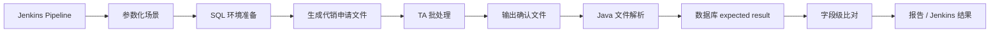

# TA 自动化测试：面试总纲

这份文档只保留面试有用内容：

- 这个项目解决什么问题
- 技术链路怎么跑
- 你具体参与了什么
- 确认文件怎么自动校验
- 高频追问怎么答

## 1. 30 秒讲法

`TA 自动化测试是围绕代销申请文件进入 TA、TA 批处理、确认文件输出、数据库结果对账这条核心闭环做的自动化回归方案。它解决的是 TA 版本升级和代销联调中人工回归成本高、外部依赖强、结果核对不稳定的问题。我参与了技术选型、确认文件解析、关键字段比对和数据库对账逻辑，也参与了场景梳理和验收。`

## 2. 1 分钟讲法

`TA 在理财销售链路里负责接收代销商的开户、申购、赎回等申请数据，完成批处理、份额确认、净值处理后，再把确认结果回传给代销商。以前这条链路很多场景依赖人工造数、外部联调、手工查文件和查库，版本升级时回归成本很高。`

`所以我们把高频场景做成自动化回归闭环：先生成代销申请文件并准备测试数据，再触发 TA 批处理，批后读取确认文件，解析成结构化记录，然后和数据库里的预期确认结果做字段级比对。Jenkins 负责统一触发和记录，SQL 负责环境准备和预期结果，Java 负责文件解析、字段比对和报告输出。我的参与点主要是技术选型、确认文件解析、数据库对账和结果验收。`

## 3. TA 业务闭环

这个项目不要讲成“普通测试工具”，要先讲 TA 的业务位置。

TA 的核心职责：

- 接收代销商申请文件
- 处理开户、申购、赎回、确认、份额、净值等数据
- 输出确认文件、净值文件、收益相关数据
- 支撑日终、夜市、批处理和代销对账

自动化测试真正验证的是：

```text
代销商申请文件
    -> TA 批处理
    -> TA 确认结果落库
    -> 确认文件输出
    -> 文件内容和数据库结果一致
```

项目价值：

- 降低对外部代销商联调的依赖
- 降低人工查文件、查库、跑批的重复成本
- 让核心回归场景可重复执行
- 升级后能更快验证 TA 对客闭环是否正常
- 出错时能定位到造数、文件、批处理、数据库或校验逻辑

## 4. 技术架构



各层职责：

| 层 | 作用 | 面试关键词 |
|---|---|---|
| Jenkins | 统一触发、参数选择、任务记录、结果归档 | Pipeline、Build with Parameters |
| SQL | 清数据、造数、改状态、生成 expected result、查结果 | 环境准备、数据库对账 |
| Linux 脚本 | 服务启停、目录处理、批处理脚本调用 | shell、日志、文件目录 |
| TA 批处理 | 被测系统，不由自动化工具替代 | 真实业务处理 |
| Java 校验逻辑 | 解析确认文件、字段比对、输出差异 | parser、comparator、report |
| 文件目录 | 模拟代销与 TA 的文件交换 | inbound、outbound、NAS |

## 5. 你具体做了什么

最稳说法：

`我不是整套自动化框架的唯一开发者，但我不是只提需求。我参与了技术选型，也参与了确认文件解析、关键字段比对、数据库结果对账这类核心校验逻辑，同时负责把业务场景拆成前置条件、执行动作和验收标准。`

可以展开成 4 点：

1. `场景拆解`
   - 明确哪些 TA 链路必须优先自动化
   - 拆出申请文件、批处理、确认文件、数据库对账的关键节点

2. `技术选型参与`
   - Jenkins 做统一入口
   - Java 做文件解析和字段比对
   - SQL 做环境准备和结果校验
   - Linux 脚本处理目录、日志、批处理环境

3. `开发参与`
   - 参与确认文件解析
   - 参与 expected/actual 字段级比对
   - 参与数据库查询和对账逻辑
   - 参与差异结果输出

4. `验收和排障`
   - 判断结果不一致是造数问题、文件问题、TA 批处理问题还是校验逻辑问题
   - 推动把人工经验沉淀为可重复验证的自动化流程

## 6. 确认文件内容自动校验

这是最值得深挖的技术点。

不要只说“文件生成了”。要说：

`确认文件校验的关键是 expected result 和 actual result 的字段级对账。`

典型流程：

1. 根据批次号、业务日期、销售商定位确认文件
2. 解析确认文件，把每行转成确认记录对象
3. 从数据库读取本次批处理的预期确认结果
4. 按申请编号、客户号、产品号对齐记录
5. 比对确认状态、确认金额、确认份额、净值、确认日期、原因码
6. 处理金额精度、日期格式、补零、空格、枚举值映射
7. 输出差异明细
8. 如果关键字段不一致，让 Jenkins 对应 stage 失败

可以这样答：

`我参与的校验逻辑不是只看文件是否生成，而是把确认文件解析成结构化记录，再从数据库拿 expected result，按申请编号对齐 actual result，逐字段比较确认状态、金额、份额、净值和日期。如果出现差异，输出具体字段的 expected/actual，方便判断是造数、TA 处理、文件格式还是校验逻辑的问题。`

## 7. 为什么用 Jenkins

一句话：

`Jenkins 不是业务逻辑，而是把复杂回归流程变成可参数化、可记录、可重复执行的统一入口。`

它解决：

- 不同人执行步骤不一致
- 手工跑批容易漏步骤
- 执行结果难追溯
- 回归场景难复用

面试答法：

`我们用 Jenkins 把场景、日期、销售商、环境这些参数收敛成统一入口。测试或开发人员触发后，流水线按步骤执行造数、文件生成、批处理检查、文件解析和结果比对。这样每次版本升级时，不需要重新手工串流程。`

## 8. 为什么 SQL 很重要

TA 批处理强依赖数据库状态。

SQL 在项目里负责：

- 清理上次测试残留
- 初始化产品、客户、交易申请
- 设置业务日期、产品状态、交易状态
- 查询批处理结果
- 构造 expected confirmation

面试答法：

`TA 这类批处理场景很多状态只能通过数据库高效准备和验证。如果完全走页面，慢且不稳定。SQL 在这里既是环境准备手段，也是结果校验手段。`

## 9. 为什么还要看文件、缓存、节点

数据库对了，不代表闭环一定对。

还要看：

- 确认文件是否生成
- 文件名、日期、批次号是否正确
- 文件内容是否和库表一致
- 缓存是否刷新
- 批处理节点是否全部通过
- 报错节点定位在哪里

面试答法：

`这个项目验证的是 TA 和代销商之间的文件交互闭环，所以文件本身就是结果的一部分。库表、文件、缓存和批处理节点要一起看，否则可能出现库里对了但文件没出、文件出了但字段错、节点通过但缓存没刷新的情况。`

## 10. 结果不一致怎么排查

按 5 层排：

1. `测试输入`
   - 申请文件是否正确
   - 批次号、日期、销售商是否一致

2. `环境准备`
   - 数据是否清干净
   - 产品、客户、交易状态是否符合前置条件

3. `TA 批处理`
   - 批处理节点是否成功
   - 日志是否报错

4. `数据库结果`
   - 确认结果是否正确落库
   - expected result 是否查对表、查对批次

5. `校验逻辑`
   - 文件解析是否错位
   - 金额精度、日期格式、状态码映射是否处理正确

面试答法：

`我不会一上来就判断是系统 bug。会先看申请文件和批次参数，再看环境数据和前置状态，然后看 TA 批处理节点和数据库结果，最后检查解析和比对逻辑。这样能避免把造数问题、环境问题、校验问题误判成系统问题。`

## 11. 高频追问

### 1. 这个项目是不是 UI 自动化？

不是纯 UI 自动化。

更准确是：

`场景化集成回归自动化。`

UI 或页面只是辅助，核心是文件、批处理、数据库和结果比对。

### 2. 你是不是唯一主开发？

不是。

稳答：

`我不是底层框架和全部流水线的唯一开发者，但我参与了技术选型、确认文件解析、字段级比对和数据库对账，也负责把业务场景拆成可自动化验证的规则和验收标准。`

### 3. 这个项目最难的点是什么？

不是写 parser，而是把复杂批处理链路稳定串起来。

难点包括：

- 时间和状态依赖
- 文件格式和字段精度
- expected result 生成
- 批处理节点排障
- 防止假失败

### 4. 为什么这条项目适合开发岗？

因为它不是单纯测试执行，而是有工程化实现：

- Java 文件解析
- SQL 对账
- Jenkins 编排
- 批处理链路理解
- 自动化报告和异常定位

### 5. 如果确认文件字段不一致，可能是什么原因？

可能原因：

- 申请文件输入错
- TA 批处理逻辑错
- 数据库 expected result 取错
- 文件格式变化
- 金额/份额精度处理错
- 状态码映射错

## 12. 不要讲太满

不要说：

- “整套 Jenkinsfile 都是我写的”
- “底层框架全是我搭的”
- “TA 批处理是我们的工具实现的”
- “全流程完全无人值守”

可以说：

- “我参与了关键校验逻辑”
- “我理解整条自动化链路”
- “我能讲清文件解析和数据库对账”
- “我负责把业务场景和校验点定义清楚”

## 13. 最后背诵版

`TA 自动化测试的本质，是把代销申请文件进入、TA 批处理、确认文件输出、数据库对账这条核心闭环做成可重复执行的回归验证。Jenkins 负责统一触发，SQL 负责环境准备和 expected result，Java 负责确认文件解析和字段级比对。我参与了技术选型、解析逻辑、数据库对账和验收排障。这条项目最能体现我对金融批处理、文件交互和自动化测试工程化的理解。`
