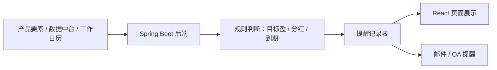
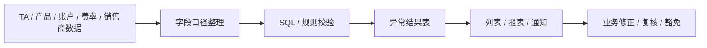
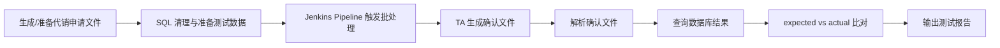

# 三条开发项目的开发参与版全流程讲法

这份文档只解决一个问题：面试官问“你过去做过哪些真正偏开发的项目”时，如何把三条主战项目讲成 `真实参与、技术链路清楚、能抗追问` 的版本。

三条主线：

- 产品生命周期管理系统：自研前后端系统，主打 `Spring Boot 后端 + 数据库设计 + 提醒规则 + 邮件/OA 对接`。
- TA 批前预警静态参数稽核：自研规则稽核能力，主打 `规则口径 + SQL/校验逻辑 + 异常结果闭环`。
- TA 自动化测试：自动化回归方案，主打 `Jenkins Pipeline + 文件解析 + 数据库比对 + 批处理闭环`。

## 统一开场

“我过去三年在金融机构里确实有不少需求、交付和 UAT 工作，但也参与过几条偏开发和工具化的项目。最适合展开的是三条：第一是产品生命周期管理系统，我参与了后端规则、数据库设计、数据联调和提醒接口；第二是 TA 批前预警里的静态参数稽核，我参与了稽核规则和系统化检查逻辑；第三是 TA 自动化测试，我参与了 Jenkins 自动化回归链路里的确认文件解析和数据库比对。这三条项目能比较完整地说明，我不是只做产品经理式协调，也参与过真实系统和工具的开发落地。”

## 项目一：产品生命周期管理系统

### 30 秒讲法

“产品生命周期管理系统是正式产品管理系统上线前，我们内部先做的一套自研辅助系统，用来管理目标盈、分红封闭式、定期分红等产品在存续期内的关键节点提醒。技术上后端是 Spring Boot，前端基于内部 React 低代码平台，数据来自数据中台和产品要素表，提醒结果通过页面、邮件和 OA 推送给业务。我主要参与后端规则实现、数据库设计、数据联调、提醒结果落库，以及邮件/OA 接口对接。”

### 技术链路

### 你可以认领的开发工作

| 模块 | 可讲内容 |
| --- | --- |
| 后端服务 | 产品节点查询、提醒规则计算、提醒状态流转 |
| 数据库设计 | 产品基础要素、个性化规则、工作日历、提醒记录 |
| 数据联调 | 从数据中台获取净值、收益、产品状态等字段 |
| 外部接口 | 对接邮件和 OA，把系统提醒推到业务常用入口 |
| 前端参与 | 参与 React 页面接口联动和字段展示，不包装成唯一前端负责人 |

### 最适合展开的功能：目标盈提醒

目标盈提醒不是固定日期提醒，而是基于产品信息和收益/净值数据判断是否接近目标条件。

可按五步讲：

1. 读取产品基础信息和目标收益参数。
2. 从数据中台获取净值、收益或达标判断所需数据。
3. 按产品规则判断是否达到提醒条件。
4. 将提醒结果落库，记录产品、提醒类型、触发时间和状态。
5. 页面展示，同时通过邮件/OA 通知业务处理。

### 高频追问

| 问题 | 答法 |
| --- | --- |
| 为什么要做自研系统？ | 正式产品管理系统还没上线，但业务已有目标盈、分红等急需管理的存续期节点，先用自研系统承接真实需求。 |
| 为什么不用 Excel？ | Excel 无法稳定处理规则判断、工作日历、提醒状态、邮件/OA 通知和多人协同闭环。 |
| 数据库怎么设计？ | 按基础要素、个性化规则、工作日历、提醒记录分层，避免所有字段堆在一张表里。 |
| 你做了前端吗？ | 我参与接口联动和部分页面展示，但主线是后端、数据库、规则和接口对接。 |

## 项目二：TA 批前预警静态参数稽核

### 30 秒讲法

“TA 批前预警里我更熟的是静态参数稽核。它和交易类批前预警不同，不是主要看申购规模和持有限额，而是检查托管账号、销售商清算账号、费率、开放期、日期、产品状态等参数是否漏设、错设或冲突。这些问题如果进入夜间批处理或清算链路，排查成本很高。所以我们把检查项沉淀成规则，在跑批前统一执行。我参与了规则清单梳理、口径定义、可执行检查逻辑和结果验证。”

### 技术链路

### 你可以认领的开发工作

| 模块 | 可讲内容 |
| --- | --- |
| 稽核项拆分 | 将检查分成交易类批前预警和静态参数稽核 |
| 口径定义 | 明确字段来源、适用产品范围、异常条件 |
| 规则实现 | 将业务检查项转成 SQL 或后端规则判断 |
| 结果输出 | 输出产品、异常字段、当前值、异常原因、执行批次 |
| 验证闭环 | 用历史问题或模拟数据验证误报、漏报和处理流程 |

### 典型规则举例

| 稽核项 | 判断方式 | 风险 |
| --- | --- | --- |
| 托管账号缺失 | 产品处于可销售/存续状态，但托管账号为空 | 清算和资金划付受影响 |
| 销售商清算账号缺失 | 产品有关联销售商，但销售商清算账号未维护 | 代销清算文件异常 |
| 费率参数缺失 | 产品配置了收费逻辑，但费率为空或分成比例为空 | 费用计算错误 |
| 开放期异常 | 开放日、确认日、到账日不符合产品规则 | 交易受理或确认异常 |
| 产品状态冲突 | 产品状态和交易控制状态不一致 | 不该交易的产品被受理，或应交易产品无法交易 |

### 高频追问

| 问题 | 答法 |
| --- | --- |
| 和监控平台区别？ | 监控看系统运行状态，稽核看业务规则是否能安全进入跑批。 |
| 为什么适合自研？ | 静态参数规则高度依赖本机构产品形态和运营口径，厂商标准能力不一定覆盖。 |
| 误报怎么办？ | 分清规则口径、数据质量和业务例外，再调整规则、修数据或建立豁免。 |
| 漏报怎么办？ | 查数据源是否完整、适用范围是否过窄、结果展示是否过滤。 |

## 项目三：TA 自动化测试

### 30 秒讲法

“TA 自动化测试是围绕代销申请文件进入、TA 批处理、确认文件回传这条闭环做的自动化回归方案。它不是普通 UI 自动化，而是通过 Jenkins Pipeline 统一触发，前面用 SQL 准备环境和数据，中间触发批处理，后面解析确认文件并和数据库结果比对。我参与了自动化思路、技术选型、确认文件解析和数据库比对代码，所以对这条链路比较熟。”

### 技术链路

### 你可以认领的开发工作

| 模块 | 可讲内容 |
| --- | --- |
| 场景拆解 | 把申请、批处理、确认、查库、断言拆成自动化步骤 |
| 技术选型 | 使用 Jenkins Pipeline 做统一触发入口 |
| 文件解析 | 解析确认文件字段，如交易账号、产品代码、确认状态、份额、金额 |
| 数据库比对 | 将确认文件结果和 TA 数据库交易结果做 expected/actual 对比 |
| 异常定位 | 区分工具解析问题、测试数据问题、系统逻辑问题 |

### 结果不一致怎么排查

固定三层：

1. 先查工具：文件解析、字段类型、前后空格、金额精度、日期格式是否处理正确。
2. 再查环境：测试数据、批次日期、数据库清理、前置状态是否正确。
3. 最后查系统：批处理逻辑、确认文件生成逻辑、接口改造是否引入回归问题。

### 高频追问

| 问题 | 答法 |
| --- | --- |
| 为什么不用人工测？ | 人工准备文件、跑批、查库、对文件成本高且不稳定，自动化能做高频回归。 |
| 为什么用 Jenkins？ | Jenkins 适合把环境准备、批处理触发、校验脚本和报告输出串成稳定流水线。 |
| 难点在哪里？ | 文件和数据库字段口径要一致，金额精度、状态码、日期、空值都可能导致误判。 |
| 怎么证明工具可靠？ | 用人工验证过的样例先校准解析和比对逻辑，再逐步扩展场景。 |

## 三条项目的组合价值

| 项目 | 证明什么 |
| --- | --- |
| 产品生命周期管理系统 | 你能做前后端系统里的后端规则、数据库、接口和提醒能力 |
| TA 批前预警静态稽核 | 你能把金融后台规则沉淀成可执行检查逻辑 |
| TA 自动化测试 | 你能把批处理和文件交互链路做成自动化回归 |

统一收口：

“这三条项目共同点是都不是炫技型项目，而是金融机构里很真实的工程问题：怎么把业务规则、批处理风险和人工经验变成系统能力。它们也比较符合这个岗位需要的 Java 后端、测试上线、自动化、跨部门沟通和金融业务理解。”

## 面试前最小背诵版

“我最能展开的三条开发项目是生命周期系统、TA 静态参数稽核和 TA 自动化测试。生命周期系统主打 Spring Boot 后端、数据库设计、目标盈/分红提醒和邮件/OA 对接；TA 静态参数稽核主打把账户、费率、开放期、日期、状态等批前检查规则化；TA 自动化测试主打 Jenkins Pipeline、确认文件解析和数据库结果比对。我的优势不是说每条都是我一个人从零写完，而是我既懂业务规则，也参与过把规则落成系统、脚本和自动化链路。”
