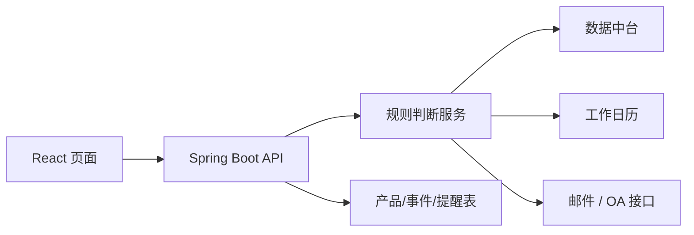

# 产品生命周期管理系统：项目讲法

## 1. 一句话定位

`这是正式产品管理系统上线前，我们自研的一套内网前后端系统，用来管理特殊理财产品在成立、存续、分红、收益达标、到期等阶段的关键事件，并通过页面、邮件和 OA 做协同提醒。`

不要讲成“提醒小工具”，要讲成：

`业务规则系统化 + 生命周期事件管理 + 协同提醒。`

## 2. 30 秒讲法

`产品生命周期管理系统主要解决特殊理财产品关键节点容易依赖人工记忆和线下沟通的问题。比如目标盈产品要关注收益是否达到触发条件，分红封闭式产品要提前准备分红事项。系统通过 Spring Boot 后端承接规则判断和事件生成，React 前端展示事件和状态，再通过邮件/OA 推送提醒。我主要参与后端规则逻辑、数据库设计、数据中台联调和提醒接口对接，前端也参与了页面和接口联动。`

## 3. 业务背景

特殊产品的生命周期不是只看一个固定到期日。

典型场景：

- `目标盈产品`：收益接近或达到目标条件时，要提醒业务关注提前到期或后续处理。
- `分红封闭式产品`：根据成立日、分红计划、工作日历提前触发分红准备。
- `定期分红产品`：需要按周期管理分红测算、确认、披露等动作。

如果靠人工：

- 节点容易漏
- 口径分散
- 跨产品、投资、销售、运营协同成本高
- 新产品类型增加后维护更困难

系统化后的价值：

- 把关键节点变成事件
- 把业务规则变成后端逻辑
- 把提醒状态变成可追踪记录
- 把线下通知变成页面、邮件、OA 联动

## 4. 技术架构



| 模块 | 作用 |
|---|---|
| React 页面 | 产品查询、事件列表、提醒状态、人工处理入口 |
| Spring Boot Controller | 接收页面请求，提供事件查询和状态变更接口 |
| Service 规则层 | 判断目标盈、分红、到期等事件是否触发 |
| 数据库 | 存产品要素、个性化参数、工作日历、提醒记录 |
| 数据中台接口 | 提供产品基础信息、收益/净值等外部数据 |
| 邮件/OA 接口 | 把系统事件推送到业务常用工作入口 |

## 5. 数据库怎么讲

不用背字段，但要讲清分层。

| 表/数据层 | 作用 |
|---|---|
| 产品基础要素表 | 产品代码、名称、类型、成立日、到期日、状态 |
| 产品个性化参数表 | 目标收益阈值、分红规则、特殊产品参数 |
| 工作日历表 | 判断 T-N、节假日顺延、分红准备日 |
| 生命周期事件表 | 记录应触发的事件类型、产品、触发日期、状态 |
| 提醒记录表 | 记录是否已提醒、提醒渠道、接收人、发送结果 |

面试说法：

`我会把基础要素、个性化规则、工作日历和提醒结果拆开存。这样规则变化时不需要把所有逻辑硬编码在一张表里，也方便后续按产品类型扩展。`

## 6. 你具体做了什么

最稳说法：

`我主做后端这一侧，包括业务规则判断、数据库设计、数据中台联调、提醒结果落库和邮件/OA 接口对接；前端我参与页面接口联动和部分交互，但不是唯一前端负责人。`

可以展开：

- 把目标盈、分红、到期等业务规则拆成后端可判断条件
- 设计产品基础要素、个性化参数、工作日历、事件和提醒记录相关表
- 联调数据中台，获取产品要素、净值/收益等数据
- 实现提醒触发、提醒状态落库、邮件/OA 发送
- 配合前端完成事件列表、提醒状态、处理入口的接口联动

## 7. 重点功能：目标盈提醒

业务逻辑：

```text
读取产品基础信息
    -> 获取目标收益阈值和产品状态
    -> 从数据中台获取收益/净值相关数据
    -> 判断是否达到提醒条件
    -> 生成生命周期事件
    -> 落提醒记录
    -> 页面展示 + 邮件/OA 推送
```

排查思路：

1. `规则口径`：看用哪个收益指标、阈值、触发频率。
2. `数据来源`：看数据中台是否有数据、是否最新、口径是否一致。
3. `规则实现`：看边界值、比较符号、产品状态过滤。
4. `提醒链路`：看事件是否落库、邮件/OA 是否发送、是否重复提醒。

## 8. 和产品管理系统的关系

必须讲清边界：

- `产品生命周期管理系统`：自研，聚焦特殊产品节点提醒和事件管理。
- `产品管理系统`：供应商采购，正式统一平台，覆盖产品要素、说明书生成、审批流、下游集成。

面试说法：

`生命周期系统不是后续产品管理系统本身，它是在正式统一平台上线前，为了先承接特殊产品节点管理需求而自研的辅助系统。`

## 9. 这条项目最适合证明什么

- 你做过 Spring Boot 后端开发
- 你能把金融业务规则转成系统逻辑
- 你理解前后端接口联动
- 你接触过数据库设计和外部系统联调
- 你不是只做需求和交付

## 10. 最后背诵版

`产品生命周期管理系统是正式产品管理系统上线前自研的一套前后端系统，用来管理目标盈、分红封闭式等特殊理财产品的关键生命周期事件。后端 Spring Boot 负责规则判断、事件生成、数据中台联调和邮件/OA 提醒，前端 React 负责事件展示和状态交互。我主要参与后端规则、数据库设计、数据联调和提醒接口，对我来说这条项目最能体现把金融业务规则转成系统能力。`

## 11. 复现项目技术文档

如果面试官继续追问“这个系统怎么拆业务线、怎么写后端、怎么设计跑批和提醒闭环”，看这组复现项目文档：

- [产品生命周期管理系统复现项目](notes/面试学习/开发岗/开发课程/03_项目表达/产品生命周期管理系统复现项目/README.md)

这组材料重点补：

- 定期分红和目标盈两条业务线怎么拆
- 产品基础数据、工作日历、行情、分红方案等外部数据边界
- Java 后端、数据库、前端接口、跑批、文件输出和日志怎么串起来
- 怎么把“项目参与经历”讲成“我知道系统如何落地”
