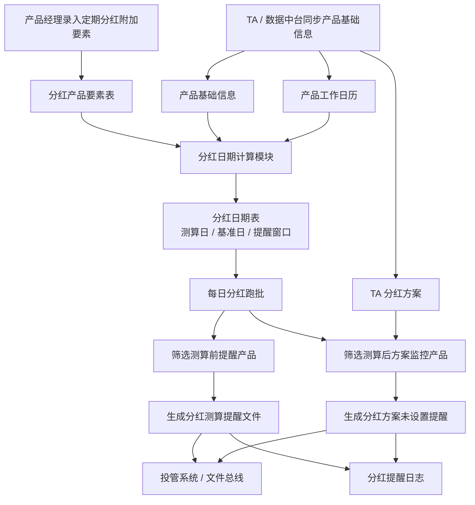
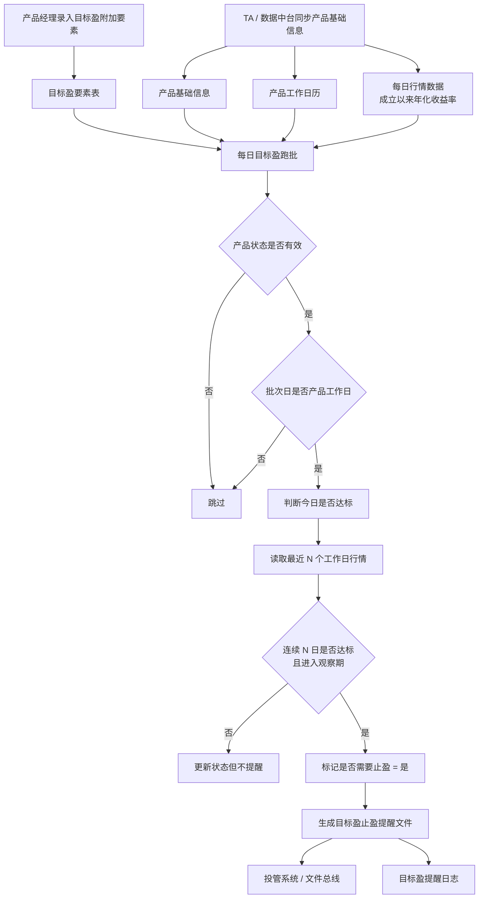

# 产品生命周期管理系统复现：工作流教学版

## 1. 这个项目为什么要做

产品生命周期管理系统，简称 PLM，不是为了替代 TA，也不是单纯做产品信息录入页面。它真正要解决的是：产品发行后，生命周期内会出现越来越多需要持续追踪的重大事件，单靠人工登记、人工提醒、人工查系统，很容易遗漏。

从建设说明看，系统建设背景主要有三类痛点：

1. 产品生命周期重大事件缺乏监控。分红、目标盈、份额核减、提前终止等事件越来越多，人工跟踪工作量大，且容易遗漏。
2. 批量产品信息收集困难。产品数量增加后，产品参数、状态和重要条款缺乏统一管理和复核平台。
3. 跨部门协作存在遗漏风险。产品部、投资经理、销售、运营、TA、风险合规等角色之间依赖线下沟通，信息不对称，沟通成本高。

所以 PLM 的核心价值可以概括为：

```text
把产品生命周期内的重要要素和重大事件集中管理，并通过跑批、提醒、文件接口和日志，把原来依赖人工经验的跟踪动作系统化。
```

## 2. 业务拆分原则

这个项目里，**定期分红** 和 **目标盈** 是两个不同业务场景，不能混成一个大业务模块。

正确拆法是：

```text
产品生命周期管理系统
  ├─ 定期分红业务线
  │   ├─ 分红要素录入
  │   ├─ 分红日期计算
  │   ├─ 分红测算前提醒
  │   ├─ 分红方案未设置监控
  │   └─ 分红提醒日志
  │
  ├─ 目标盈业务线
  │   ├─ 目标盈要素录入
  │   ├─ 达标监控
  │   ├─ 连续达标判断
  │   ├─ 止盈提醒
  │   └─ 目标盈提醒日志
  │
  └─ 公共支撑能力
      ├─ 产品基础数据
      ├─ 产品工作日历
      ├─ 行情数据
      ├─ 文件输出
      ├─ 批处理日志
      └─ 报告归档
```

也就是说：

```text
业务逻辑要按业务线拆。
公共技术能力可以复用。
```

## 3. 系统边界

PLM 负责：

- 录入业务附加要素，例如分红频率、首次分红间隔、目标止盈收益率、业绩观察期起始日期。
- 同步或导入来自 TA/数据中台的基础产品数据、工作日历、行情净值、分红方案。
- 在定期分红业务线中，计算分红测算日、分红基准日、提醒窗口。
- 在目标盈业务线中，判断今日达标、连续达标、是否需要止盈。
- 生成投管提醒文件或邮件提醒内容。
- 记录提醒日志和跑批日志。

TA / 数据中台负责：

- 提供产品基础信息。
- 提供产品工作日历。
- 提供产品行情、净值、成立以来年化收益率。
- 提供已录入的分红方案信息。

投管 / 邮件系统负责：

- 接收 PLM 生成的提醒文件或邮件内容。
- 展示待办、弹窗或邮件提醒。

## 4. 定期分红业务线

### 4.1 业务目标

定期分红功能要解决的问题是：

```text
产品合同约定了分红安排后，如何让系统自动计算分红测算日、提前提醒投资经理准备分红测算，并在测算日后监控 TA 是否已录入分红方案。
```

它关注的是：

```text
分红条款
分红测算日
分红基准日
TA 分红方案是否录入
测算前提醒
测算后监控
```

### 4.2 定期分红大模块和小模块

```text
定期分红业务线
  ├─ 分红产品要素录入模块
  │   ├─ 产品代码/名称选择
  │   ├─ 是否强制分红
  │   ├─ 首次分红间隔天数
  │   ├─ 首次分红测算净值
  │   ├─ 分红频率
  │   ├─ 年化分红率上限
  │   ├─ 单次分红净值上限
  │   ├─ 分红净值下限
  │   ├─ 测算前提醒天数
  │   └─ 测算后监控天数
  │
  ├─ 分红日期计算模块
  │   ├─ 首次分红测算日计算
  │   ├─ 分红基准日计算
  │   ├─ 后续分红测算日滚动计算
  │   ├─ 测算前提醒窗口计算
  │   └─ 测算后方案监控窗口计算
  │
  ├─ 分红测算前提醒模块
  │   ├─ 查找当日处于测算前提醒窗口的产品
  │   ├─ 生成投管提醒内容
  │   └─ 生成投管提醒文件
  │
  ├─ 分红方案未设置监控模块
  │   ├─ 查找当日处于测算后监控窗口的产品
  │   ├─ 对比 TA 分红方案表
  │   ├─ 判断是否缺少分红方案
  │   └─ 生成方案未设置提醒
  │
  └─ 分红日志模块
      ├─ 投管分红测算提醒日志
      ├─ 投管方案提醒日志
      └─ 邮件提醒日志
```

### 4.3 定期分红流程图



### 4.4 定期分红核心动作

1. 录入分红附加要素。
2. 同步 TA 产品基础数据。
3. 同步产品工作日历。
4. 根据成立日和首次分红间隔计算首次分红测算日。
5. 根据分红频率生成后续分红测算日。
6. 计算分红基准日。
7. 计算测算前提醒窗口。
8. 计算测算后分红方案监控窗口。
9. 每日跑批筛选测算前提醒。
10. 每日跑批筛选 TA 未录入分红方案的产品。
11. 生成投管提醒文件。
12. 记录分红提醒日志。

## 5. 目标盈业务线

### 5.1 业务目标

目标盈功能要解决的问题是：

```text
目标盈产品进入业绩观察期后，如何每日监控成立以来年化收益率是否达到目标止盈收益率，并在连续 N 个工作日达标后提醒业务进行提前终止操作。
```

它关注的是：

```text
目标止盈收益率
业绩观察期起始日期
连续达标天数
成立以来年化收益率
今日是否达标
是否需要止盈
```

### 5.2 目标盈大模块和小模块

```text
目标盈业务线
  ├─ 目标盈产品要素录入模块
  │   ├─ 产品代码/名称选择
  │   ├─ 目标止盈收益率
  │   ├─ 业绩观察期起始日期
  │   ├─ 连续达标止盈天数
  │   └─ 产品相关负责人
  │
  ├─ 目标盈产品管理模块
  │   ├─ 产品状态展示
  │   ├─ 当日确认累计净值展示
  │   ├─ 当日确认年化收益率展示
  │   ├─ 今日是否达标展示
  │   └─ 是否需要止盈展示
  │
  ├─ 达标监控模块
  │   ├─ 跳过发行失败/产品终止产品
  │   ├─ 判断当前日期是否产品工作日
  │   ├─ 读取当日行情年化收益率
  │   └─ 判断今日是否达标
  │
  ├─ 连续达标判断模块
  │   ├─ 读取最近 N 个工作日行情
  │   ├─ 判断是否全部达到目标止盈收益率
  │   ├─ 判断 N 日窗口是否已进入观察期
  │   └─ 标记是否需要止盈
  │
  └─ 目标盈提醒模块
      ├─ 生成止盈提醒内容
      ├─ 复用投管提醒文件接口
      └─ 记录目标盈提醒日志
```

### 5.3 目标盈流程图



### 5.4 目标盈核心动作

1. 录入目标盈附加要素。
2. 同步产品基础信息。
3. 同步产品工作日历。
4. 同步每日行情和成立以来年化收益率。
5. 每日跑批遍历目标盈产品。
6. 跳过发行失败和产品终止产品。
7. 跳过非产品工作日。
8. 判断今日是否达标。
9. 读取最近 N 个工作日行情。
10. 判断是否连续 N 个工作日达标。
11. 判断是否已进入业绩观察期。
12. 标记是否需要止盈。
13. 生成投管止盈提醒。
14. 记录目标盈提醒日志。

## 6. 公共支撑模块

公共支撑模块不是一个业务线，它们服务于定期分红和目标盈。

```text
公共支撑能力
  ├─ 产品基础数据模块
  │   └─ 产品代码、名称、状态、成立日、到期日、投资经理
  ├─ 产品工作日历模块
  │   └─ 产品维度工作日，用于日期计算和连续达标判断
  ├─ 行情数据模块
  │   └─ 净值、成立以来年化收益率
  ├─ 文件接口模块
  │   └─ 生成投管提醒 CSV，模拟文件总线
  ├─ 日志模块
  │   └─ 跑批日志、提醒日志
  └─ 报告模块
      └─ 输出 Markdown 批处理报告
```

面试里可以这样说：

```text
分红和目标盈是两个业务域，规则不能混在一起；但它们都依赖产品基础信息、工作日历、行情、文件接口和日志，所以这些能力可以作为公共支撑层复用。
```

## 7. 本地复现如何对应真实系统

| 本地复现 | 真实系统映射 |
| --- | --- |
| H2 表 `plm_product` | TA / 数据中台产品基础信息 |
| H2 表 `plm_workday_calendar` | 产品工作日历 |
| H2 表 `plm_market_daily` | 行情净值和收益率 |
| H2 表 `plm_dividend_input` | PLM 定期分红要素录入 |
| H2 表 `plm_target_yield_input` | PLM 目标盈要素录入 |
| H2 表 `plm_profit_schema` | TA 分红方案 |
| CSV 输出 | PLM 到投管的提醒文件 |
| Markdown 报告 | 跑批结果和面试复盘材料 |

## 8. 开发时为什么先拆业务线

如果不拆业务线，容易把系统讲成：

```text
一个每日跑批系统，跑完生成提醒。
```

这太粗了。

更准确的讲法应该是：

```text
PLM 是产品生命周期重大事件监控平台。定期分红和目标盈都是重大事件，但它们的业务触发条件不同：定期分红围绕测算日、基准日和 TA 分红方案；目标盈围绕观察期、连续达标天数和成立以来年化收益率。因此开发时要按业务线拆模块，再抽公共能力复用。
```

