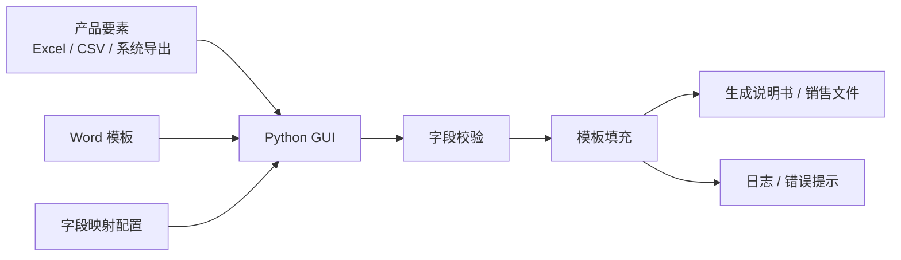

# 产品说明书按模板一键生成工具：轻量复习

一句话定位：

`正式产品管理系统上线前的 Python GUI 轻量工具，用模板、字段映射和基础校验自动生成产品说明书/销售文件。`

它是补充项目，不是高盛工银开发岗主战项目。面试里用来证明你能快速把重复业务操作工具化，不要讲成大型平台。

## 30 秒讲法

“产品说明书自动生成工具是我早期做过的一个 Python 图形化工具，主要在正式产品管理系统上线前承接说明书和销售文件生成需求。它把产品要素、说明书模板和字段映射关系组织起来，业务同事选择产品和模板后，工具自动填充占位符、处理日期/金额/百分比格式，并做必填字段和未替换占位符校验。它技术复杂度不是最高，但解决了人工复制粘贴、字段漏填和格式整理成本高的问题，也为后续产品管理系统里的模板化文档生成做了前期验证。”

## 业务输入输出

| 类型 | 内容 |
| --- | --- |
| 输入数据 | 产品代码、名称、风险等级、期限、开放规则、收益分配、投资范围、费率等产品要素 |
| 模板文件 | 封闭式、目标盈、分红、定开等不同产品系列说明书模板 |
| 字段映射 | `{{product_name}} -> 产品名称`，`{{risk_level}} -> 风险等级` |
| 用户配置 | 选择产品、模板、输出目录、是否覆盖、是否校验 |
| 输出结果 | 生成后的说明书/销售文件、生成日志、缺失字段或校验失败提示 |

## 技术架构

## 核心逻辑

1. 读取产品要素，将 Excel、CSV 或导出文件转成结构化字段。
2. 根据产品类型或用户选择确定模板。
3. 加载占位符和产品字段的映射关系。
4. 填充模板，同时处理日期、金额、百分比、空值和可选条款。
5. 校验必填字段、未替换占位符和输出文件。
6. 生成文件、日志和错误提示。

## 技术点怎么讲

| 技术点 | 答法 |
| --- | --- |
| GUI | 面向业务同事使用，不要求命令行操作，降低使用门槛 |
| 模板化 | 不把字段写死在代码里，用占位符和映射配置解耦 |
| 格式化 | 日期、金额、百分比、空值要统一处理，避免人工格式不一致 |
| 校验 | 生成前检查必填字段，生成后检查未替换占位符 |
| 日志 | 记录输入、模板、输出路径、缺失字段，方便排查 |

## 和产品管理系统的关系

产品管理系统是后续采购的正式平台，覆盖产品要素管理、流程审批、文档生成和下游系统集成。

说明书生成工具是正式平台上线前的过渡工具，先把最重复、最容易出错的文档生成环节自动化。

和产品生命周期系统的区别：

- 生命周期系统偏 `节点提醒、目标盈/分红/到期事件、邮件/OA 通知`。
- 说明书工具偏 `模板填充、字段映射、文档生成、格式校验`。

## 高频追问

| 问题 | 答案 |
| --- | --- |
| 为什么不用人工改 Word？ | 少量可以人工改，但新产品频繁发行后容易漏字段、格式不一致、口径不统一。 |
| 字段映射怎么设计？ | 模板用占位符，配置维护占位符和产品字段的关系，模板变化时不需要大改生成逻辑。 |
| 怎么防止漏填？ | 生成前做必填字段校验，生成后检查是否还有未替换占位符。 |
| 最难的点是什么？ | 不同产品系列字段差异、模板差异和格式要求要收敛成可维护规则。 |
| 如果现在重做怎么优化？ | 把模板、映射和校验规则服务端配置化，增加生成版本记录，方便追溯每份文件基于哪个要素版本生成。 |

## 边界

可以说：

- “这是我早期完整实现度比较高的 Python GUI 工具。”
- “核心是模板化、字段映射、文件生成和校验。”
- “它服务于正式产品管理系统上线前的过渡需求。”

不要说：

- “这是大型后端平台。”
- “它代表我最强 Java 后端能力。”
- “它替代了正式产品管理系统。”

## 最小背诵版

“说明书生成工具是正式产品管理系统上线前的 Python GUI 过渡工具。它读取产品要素，选择对应模板，通过字段映射填充占位符，并做必填字段、格式和未替换占位符校验，最后生成说明书或销售文件。它不复杂，但很真实地解决了业务侧重复、易错、耗时的文档生成问题。”
