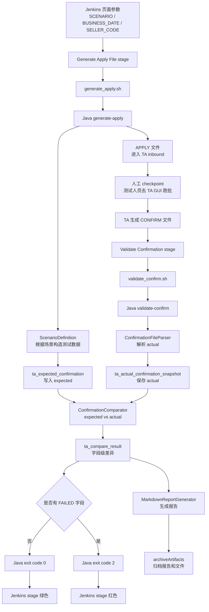

# Expected vs Actual 对账如何从 Java 业务逻辑体现到 Jenkins 流水线

这份文档专门解释：

> 批后确认文件对账这件事，是如何从 Java 代码里的字段级比较，传递到 Jenkins 页面上的绿色/红色 stage，以及最终的测试报告里的。

这条链路非常重要，因为它说明自动化测试不是“跑完命令就算成功”，而是通过业务校验结果来决定 Jenkins 流水线是否成功。

---

## 1. 先理解 expected 和 actual

`expected vs actual` 是自动化测试里最核心的判断方式。

在这个 TA 回归测试项目里：

```text
expected = 批前根据场景和埋下的数据推导出来的预期确认结果
actual   = TA 批处理后生成的确认文件里的实际确认结果
```

如果 expected 和 actual 一致，说明这条 TA 申请确认链路符合预期。

如果不一致，就说明需要排查：

```text
是批前造数错了？
是申请文件错了？
是 TA 批处理逻辑有问题？
是确认文件格式变了？
还是自动化解析/比对逻辑错了？
```

---

## 2. expected 是如何生成的

expected 在批前阶段生成。

当 Jenkins 执行：

```text
Generate Apply File
```

这个 stage 时，它实际调用：

```groovy
sh "./scripts/generate_apply.sh ${params.SCENARIO} ${params.BUSINESS_DATE} ${params.SELLER_CODE} ${env.BATCH_NO}"
```

Shell 脚本再调用 Java：

```bash
java -jar target/ta-automation-replica-0.1.0.jar generate-apply \
  --scenario=T0_PURCHASE_SUCCESS \
  --businessDate=20260601 \
  --sellerCode=N8Y \
  --batchNo=BAT-T0_PURCHASE_SUCCESS-20260601-N8Y \
  --inboundDir=data/inbound
```

这里 Jenkins 传进来的参数包括：

```text
SCENARIO      场景
BUSINESS_DATE 业务日期
SELLER_CODE   代销商
BATCH_NO      批次号
```

Java 里的 `GenerateApplyCommand` 接收这些参数，然后进入：

```text
ApplyGenerationWorkflow
```

它会做两件核心事情：

```text
1. 生成申请文件
2. 生成 expected confirmation
```

比如在 `T0_PURCHASE_SUCCESS` 场景里，批前埋下的数据是：

```text
产品状态 = OPEN
客户风险有效
申请金额 = 10000.00
产品净值 = 1.020000
业务日期 = 20260601
```

所以 expected 是：

```text
confirmStatus = SUCCESS
confirmAmount = 10000.00
confirmShares = 10000.00 / 1.020000 = 9803.9216
confirmDate = 20260601
reasonCode = 0000
```

这些预期结果会写入表：

```text
ta_expected_confirmation
```

也就是说，expected 是自动化工具在批前就埋好的判断标准。

---

## 3. actual 是如何来的

actual 不是我们生成的。

真实流程里，actual 来自 TA。

流程是：

```text
自动化工具生成申请文件
        ↓
申请文件进入 TA inbound 目录
        ↓
Jenkins 暂停在人工 checkpoint
        ↓
测试人员去 TA 图形化界面手动启动批处理
        ↓
TA 读取申请文件，执行真实业务逻辑
        ↓
TA 生成确认文件
```

确认文件例子：

```text
requestNo|confirmStatus|confirmAmount|confirmShares|confirmDate|reasonCode|reasonMessage
REQ0001|SUCCESS|10000.00|9803.9216|20260601|0000|confirmed
```

当测试人员确认 TA 已生成确认文件后，回到 Jenkins 页面点击 Continue。

Jenkins 继续执行：

```text
Validate Confirmation
```

这个 stage 调用：

```groovy
sh "./scripts/validate_confirm.sh ${params.SCENARIO} ${params.BUSINESS_DATE} ${params.SELLER_CODE} ${env.BATCH_NO}"
```

Shell 再调用 Java：

```bash
java -jar target/ta-automation-replica-0.1.0.jar validate-confirm \
  --scenario=T0_PURCHASE_SUCCESS \
  --businessDate=20260601 \
  --sellerCode=N8Y \
  --batchNo=BAT-T0_PURCHASE_SUCCESS-20260601-N8Y \
  --outboundDir=data/outbound \
  --reportsDir=reports
```

Java 里的 `ValidateConfirmCommand` 接收这些参数，然后进入：

```text
ConfirmationValidationWorkflow
```

它会：

```text
1. 定位确认文件
2. 解析确认文件
3. 把解析结果作为 actual snapshot 保存
```

actual 会写入表：

```text
ta_actual_confirmation_snapshot
```

---

## 4. Java 代码如何做 expected vs actual 对账

对账核心类是：

```text
ConfirmationComparator
```

它做的事情可以拆成三步：

```text
1. 按 requestNo 对齐 expected 和 actual
2. 逐字段比较
3. 生成 CompareResult
```

为什么按 `requestNo`？

因为申请文件里每一笔交易都有唯一申请编号。TA 确认文件也应该带回这个编号。这样才能知道：

```text
这条确认结果对应哪一条申请
```

比对字段包括：

```text
confirmStatus
confirmAmount
confirmShares
confirmDate
reasonCode
```

`reasonMessage` 暂时不作为强校验字段，因为真实系统中文案可能发生版本调整，但原因码通常更稳定。

如果字段一致，生成：

```text
PASSED
```

如果字段不一致，生成：

```text
FAILED
```

并记录：

```text
requestNo
fieldName
expectedValue
actualValue
message
```

这些字段级结果写入：

```text
ta_compare_result
```

这张表的价值是：

```text
失败时不是只知道“回归失败”
而是知道“哪一笔申请、哪个字段、期望是什么、实际是什么”
```

---

## 5. Java 对账结果如何变成 Jenkins stage 绿色或红色

Jenkins 判断一个 shell 步骤是否成功，主要看退出码。

在 Linux / macOS / Jenkins 里：

```text
exit code = 0     表示成功
exit code != 0    表示失败
```

所以 Java 代码要把业务比对结果转换成进程退出码。

在 `ValidateConfirmCommand` 里，逻辑是：

```java
return result.passed() ? 0 : 2;
```

含义是：

```text
如果 expected 和 actual 全部一致，Java 返回 0
如果存在任意字段不一致，Java 返回 2
```

然后 Shell 脚本 `validate_confirm.sh` 会接住这个结果。

脚本开头有：

```bash
set -euo pipefail
```

这表示：

```text
只要 java -jar 返回非 0，脚本就失败
```

于是链路变成：

```text
字段级比对失败
        ↓
Java 返回 exit code 2
        ↓
validate_confirm.sh 失败
        ↓
Jenkins 的 Validate Confirmation stage 变红
```

如果全部通过：

```text
字段级比对通过
        ↓
Java 返回 exit code 0
        ↓
validate_confirm.sh 成功
        ↓
Jenkins 的 Validate Confirmation stage 变绿
```

这就是业务逻辑如何传递到 Jenkins 页面上的关键机制。

---

## 6. Jenkins 里这一步是如何配置的

Jenkinsfile 中对应的 stage 是：

```groovy
stage('Validate Confirmation') {
    steps {
        sh "./scripts/validate_confirm.sh ${params.SCENARIO} ${params.BUSINESS_DATE} ${params.SELLER_CODE} ${env.BATCH_NO}"
    }
}
```

这段做了几件事：

```text
1. 从 Jenkins 页面参数中取 SCENARIO
2. 从 Jenkins 页面参数中取 BUSINESS_DATE
3. 从 Jenkins 页面参数中取 SELLER_CODE
4. 从 Jenkins 环境变量中取 BATCH_NO
5. 把这些参数传给 validate_confirm.sh
6. validate_confirm.sh 再传给 Java validate-confirm 命令
```

参数传递链路是：

```text
Jenkins 页面参数
  ↓
Jenkinsfile params.*
  ↓
Shell 脚本参数 $1 $2 $3 $4
  ↓
java -jar 的 --scenario / --businessDate / --sellerCode / --batchNo
  ↓
picocli 注入 Java Command 字段
  ↓
Workflow 使用这些参数定位数据、文件和报告
```

---

## 7. 报告如何在 Jenkins 中体现

对账结果不仅影响 stage 颜色，还会生成报告。

报告生成路径是：

```text
reports/BAT-T0_PURCHASE_SUCCESS-20260601-N8Y_T0_PURCHASE_SUCCESS.md
```

报告内容包括：

```text
场景
批次号
业务日期
代销商
申请文件路径
确认文件路径
整体结果 PASS / FAIL
通过字段数
失败字段数
字段级差异明细
自动化节点日志
```

Jenkinsfile 里有：

```groovy
archiveArtifacts artifacts: 'data/inbound/*.txt,data/outbound/*.txt,reports/*.md', allowEmptyArchive: true
```

这表示：

```text
无论构建成功还是失败，都尽量归档申请文件、确认文件和报告
```

这样测试人员点进 Jenkins 某次构建时，可以下载：

```text
当时生成的 APPLY 文件
TA 返回的 CONFIRM 文件
自动化比对报告
```

这对排查很重要。

因为如果 Jenkins 只是显示红色，但没有报告，测试人员还要自己重新查文件、查库、查日志。

有报告后，就能直接看到：

```text
REQ0001 的 confirmShares 不一致
expected = 9803.9216
actual = 9803.9200
```

---

## 8. 完整链路图



---

## 9. 面试时可以怎么讲

可以这样讲：

“expected vs actual 对账在代码里是字段级比较，在 Jenkins 里体现为 Validate Confirmation 这个 stage 的成功或失败。批前 generate-apply 会根据场景数据生成预期确认结果，比如产品状态、客户风险有效期、金额和净值会决定确认状态、确认金额和确认份额。TA 手动跑批后会生成确认文件，批后 validate-confirm 会解析确认文件作为 actual，然后按 requestNo 对齐，逐字段比较 confirmStatus、confirmAmount、confirmShares、confirmDate 和 reasonCode。如果有字段不一致，Java 程序会返回非 0 退出码，Shell 脚本失败，Jenkins 的 Validate Confirmation stage 就会变红。同时我们会生成 Markdown 报告并归档到 Jenkins，方便测试人员看到具体是哪一笔、哪个字段不一致。”

这段话要讲出三层：

```text
业务层：
expected 和 actual 是否一致

技术层：
Java 字段级比较，失败返回非 0

Jenkins 层：
stage 变红，报告归档
```

---

## 10. 这套机制为什么重要

如果没有这套机制，Jenkins 只能知道：

```text
脚本有没有跑完
```

但不知道：

```text
TA 的确认结果是否业务正确
```

有了 expected vs actual 对账后，Jenkins 的成功失败就有了业务含义：

```text
绿色 = TA 确认文件关键字段符合预期
红色 = 至少一个关键字段和预期不一致
```

这就是自动化测试和普通脚本执行的区别。

普通脚本只是执行动作。

自动化测试必须能判断结果是否正确。

