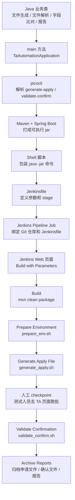

# 从 Java 代码到 Jenkins 流水线：TA 自动化测试工具是如何被触发和编排的

这份文档专门回答一个问题：

> 我写的是 Java 代码，为什么最后测试人员可以在 Jenkins 页面点一下，就触发申请文件生成、人工跑批检查点、确认文件校验和报告归档？

要理解这件事，不能一上来就说 Jenkins。应该从最底层的 Java 类开始，一层一层往上看。

整条链路是：

```text
Java class
  ↓
main 方法 + 命令行参数解析
  ↓
Maven / Spring Boot 打成可执行 jar
  ↓
Shell 脚本包装 java -jar 命令
  ↓
Jenkinsfile 定义流水线步骤
  ↓
Jenkins Pipeline Job 绑定 Git 仓库和 Jenkinsfile
  ↓
测试人员在 Jenkins 图形化页面选择参数并点击 Build
```

也就是说，Jenkins 并不是直接调用某个 Java 类。真实链路更像：

```text
Jenkins -> Shell 脚本 -> java -jar -> main 方法 -> 命令行子命令 -> Java 业务类
```

---

## 1. 第一层：Java 类只是业务能力的积木

我们一开始写的 `.java` 文件，本质上就是 Java 类。

比如这个项目里有这些类：

```text
ApplyFileGenerator
ConfirmationFileParser
ConfirmationComparator
MarkdownReportGenerator
ScenarioDefinition
ApplyGenerationWorkflow
ConfirmationValidationWorkflow
```

这些类分别负责不同的业务动作。

`ApplyFileGenerator` 负责生成申请文件：

```text
把交易申请数据写成 APPLY_20260601_N8Y.txt
```

`ConfirmationFileParser` 负责解析确认文件：

```text
读取 CONFIRM_20260601_N8Y.txt
把每一行转换成 Java 对象
```

`ConfirmationComparator` 负责比对：

```text
把预期确认结果和 TA 确认文件里的实际结果逐字段比较
```

`MarkdownReportGenerator` 负责生成报告：

```text
把比对结果写成 Markdown 报告
```

但是要注意：这些类本身不能直接在命令行里运行。

你不能在终端里直接敲：

```bash
ApplyFileGenerator
```

因为它只是一个 Java 类，不是一个操作系统命令。

所以第一步要做的是：给这些业务类外面包一层“程序入口”。

---

## 2. 第二层：main 方法是 Java 程序的入口

Java 程序想被命令行启动，通常需要一个入口：

```java
public static void main(String[] args)
```

这个项目里的入口是：

```text
src/main/java/com/example/taautomation/cli/TaAutomationApplication.java
```

它的角色不是自己处理所有业务，而是负责启动整个 CLI 程序。

当我们执行：

```bash
java -jar target/ta-automation-replica-0.1.0.jar generate-apply ...
```

Java 虚拟机会先进入 `TaAutomationApplication.main()`。

这一步可以理解成：

```text
命令行敲下 java -jar
        ↓
Java 找到 jar 里的 main 方法
        ↓
main 方法启动 Spring Boot 应用上下文
        ↓
把后面的参数交给命令行解析工具
```

但是只有 main 方法还不够。因为我们的工具不止一个动作，它至少有两个核心命令：

```text
generate-apply
validate-confirm
```

所以 main 方法还需要知道：

```text
用户这次到底是要生成申请文件？
还是要校验确认文件？
业务日期是多少？
代销商代码是什么？
场景是什么？
```

这就需要命令行参数解析。

---

## 3. 第三层：picocli 负责把命令行参数变成 Java 调用

我们用了 `picocli` 来解析命令行。

你可以把 `picocli` 理解成：

```text
命令行参数翻译器
```

它把这段命令：

```bash
java -jar target/ta-automation-replica-0.1.0.jar generate-apply \
  --scenario=T0_PURCHASE_SUCCESS \
  --businessDate=20260601 \
  --sellerCode=N8Y
```

翻译成 Java 里的对象和方法调用：

```text
子命令 = generate-apply
scenario = T0_PURCHASE_SUCCESS
businessDate = 20260601
sellerCode = N8Y
```

然后它会调用：

```text
GenerateApplyCommand.call()
```

同理，如果我们执行：

```bash
java -jar target/ta-automation-replica-0.1.0.jar validate-confirm \
  --scenario=T0_PURCHASE_SUCCESS \
  --businessDate=20260601 \
  --sellerCode=N8Y
```

它会调用：

```text
ValidateConfirmCommand.call()
```

所以这里的设计是：

```text
TaAutomationApplication
  负责程序启动

GenerateApplyCommand
  负责接收 generate-apply 命令

ValidateConfirmCommand
  负责接收 validate-confirm 命令
```

这几个类属于 `cli` 层。

它们不是最核心的业务逻辑，而是“外部命令进入系统的入口”。

---

## 4. 第四层：Command 类再调用真正的业务 Workflow

`GenerateApplyCommand` 接收到参数后，不会自己把所有逻辑写完。

它会调用：

```text
ApplyGenerationWorkflow
```

这就进入了真正的业务流程编排。

`generate-apply` 的调用链大致是：

```text
generate_apply.sh
  ↓
java -jar ... generate-apply
  ↓
TaAutomationApplication.main()
  ↓
picocli
  ↓
GenerateApplyCommand.call()
  ↓
ApplyGenerationWorkflow.run()
  ↓
ScenarioDefinition.build()
  ↓
ScenarioDataSeeder.resetBatch()
  ↓
ScenarioDataSeeder.seed()
  ↓
ApplyFileGenerator.generate()
  ↓
生成 data/inbound/APPLY_20260601_N8Y.txt
```

这条链路里，每个类各司其职。

`ScenarioDefinition` 负责定义场景：

```text
T0_PURCHASE_SUCCESS 场景下：
- 产品状态 OPEN
- 客户风险有效
- 申请金额 10000.00
- 预期确认成功
- 预期份额 = 金额 / 净值
```

`ScenarioDataSeeder` 负责埋数据：

```text
写入产品、客户、交易申请、预期确认结果
```

`ApplyFileGenerator` 负责生成文件：

```text
APPLY_20260601_N8Y.txt
```

同理，`validate-confirm` 的调用链是：

```text
validate_confirm.sh
  ↓
java -jar ... validate-confirm
  ↓
TaAutomationApplication.main()
  ↓
picocli
  ↓
ValidateConfirmCommand.call()
  ↓
ConfirmationValidationWorkflow.run()
  ↓
ConfirmationFileLocator.locate()
  ↓
ConfirmationFileParser.parse()
  ↓
ExpectedConfirmationRepository.findByBatch()
  ↓
ConfirmationComparator.compare()
  ↓
MarkdownReportGenerator.generate()
  ↓
生成 reports/*.md
```

这就是 Java 业务逻辑从“类”变成“可被命令行触发的动作”的过程。

---

## 5. 第五层：Maven 和 Spring Boot 把代码打成可执行 jar

有了 Java 类、main 方法和命令行解析后，还需要把项目打包。

我们用 Maven：

```bash
mvn clean package
```

Maven 会做几件事：

```text
1. 编译 src/main/java 里的 .java 文件
2. 生成 .class 字节码
3. 跑测试
4. 把代码和依赖打包
5. 生成 target/ta-automation-replica-0.1.0.jar
```

因为我们用了 Spring Boot Maven Plugin，所以生成的是可执行 jar。

也就是说，打包后我们可以执行：

```bash
java -jar target/ta-automation-replica-0.1.0.jar generate-apply ...
```

这一步完成后，Java 代码才真正变成一个命令行可启动的工具。

到这里为止，我们还没有用 Jenkins。

当前已经做到：

```text
Java 类
  ↓
main 方法
  ↓
命令行参数解析
  ↓
可执行 jar
  ↓
java -jar 可以启动
```

---

## 6. 第六层：Shell 脚本把 java -jar 命令包装起来

虽然 jar 已经可以执行，但完整命令很长。

比如生成申请文件要敲：

```bash
java -jar target/ta-automation-replica-0.1.0.jar generate-apply \
  --scenario=T0_PURCHASE_SUCCESS \
  --businessDate=20260601 \
  --sellerCode=N8Y \
  --batchNo=BAT-T0_PURCHASE_SUCCESS-20260601-N8Y \
  --inboundDir=data/inbound
```

如果每次都手敲，容易错，也不适合放进 Jenkins。

所以我们写了 Shell 脚本：

```text
scripts/generate_apply.sh
```

它把长命令包装成：

```bash
./scripts/generate_apply.sh T0_PURCHASE_SUCCESS 20260601 N8Y
```

这个脚本内部再调用 `java -jar`。

同理：

```text
scripts/prepare_env.sh
  准备本地目录，模拟真实项目里的环境准备

scripts/generate_apply.sh
  调用 Java 的 generate-apply 命令

scripts/manual_batch_checkpoint.sh
  提醒测试人员去 TA 图形化界面启动批处理

scripts/validate_confirm.sh
  调用 Java 的 validate-confirm 命令

scripts/demo_copy_confirm_file.sh
  只用于本地 demo，模拟 TA 已经生成确认文件
```

为什么要有 Shell？

因为 Jenkins 最擅长执行这种标准命令：

```groovy
sh './scripts/generate_apply.sh T0_PURCHASE_SUCCESS 20260601 N8Y'
```

所以 Shell 脚本相当于把 Java 程序包装成 Jenkins 可以稳定调用的步骤。

到这里，链路变成：

```text
Java class
  ↓
可执行 jar
  ↓
Shell 脚本
```

---

## 7. 第七层：Jenkinsfile 把多个 Shell 步骤编排成流水线

Shell 脚本解决的是“每一步怎么执行”。

Jenkinsfile 解决的是：

```text
这些步骤按什么顺序执行？
每一步叫什么名字？
哪些参数从 Jenkins 页面传进来？
哪里需要人工暂停？
最后归档哪些文件？
```

我们项目里的 `Jenkinsfile` 定义了这些参数：

```groovy
parameters {
    choice(name: 'ENVIRONMENT', choices: ['SIT', 'UAT'], description: 'Target TA test environment')
    choice(name: 'SCENARIO', choices: ['T0_PURCHASE_SUCCESS', 'T0_PURCHASE_PRODUCT_CLOSED', 'T0_PURCHASE_RISK_EXPIRED'], description: 'TA regression scenario')
    string(name: 'BUSINESS_DATE', defaultValue: '20260601', description: 'Business date, yyyyMMdd')
    string(name: 'SELLER_CODE', defaultValue: 'N8Y', description: 'Seller code')
}
```

这段的作用是：

```text
让 Jenkins 页面出现参数输入框或下拉框
```

测试人员可以在 Jenkins 页面选择：

```text
环境：SIT
场景：T0_PURCHASE_SUCCESS
业务日期：20260601
代销商：N8Y
```

然后 Jenkinsfile 定义了这些 stage：

```text
Checkout
Build
Prepare Environment
Generate Apply File
Manual TA Batch In GUI
Validate Confirmation
Archive Reports
```

每个 stage 执行一个动作。

比如：

```groovy
stage('Build') {
    steps {
        sh 'mvn clean package'
    }
}
```

意思是：

```text
Jenkins 调 Maven，把 Java 项目打成 jar
```

再比如：

```groovy
stage('Generate Apply File') {
    steps {
        sh "./scripts/generate_apply.sh ${params.SCENARIO} ${params.BUSINESS_DATE} ${params.SELLER_CODE} ${env.BATCH_NO}"
    }
}
```

意思是：

```text
Jenkins 把页面参数传给 generate_apply.sh
generate_apply.sh 再调用 java -jar
Java 程序生成申请文件
```

所以 Jenkinsfile 是编排层，不是业务层。

它本身不生成申请文件，也不解析确认文件。

真正干活的是：

```text
Jenkinsfile -> Shell -> Java
```

---

## 8. 第八层：人工 checkpoint 是 Jenkins 流水线里的暂停点

这个项目最特别的一步是：

```text
TA 批处理不是我们的工具跑的
```

真实项目里，TA 批处理仍然由测试人员进入 TA 图形化界面手动启动。

所以 Jenkins 流水线不能设计成：

```text
生成申请文件 -> 自动跑 TA 批处理 -> 校验确认文件
```

这样会越界。

正确设计是：

```text
生成申请文件 -> Jenkins 暂停 -> 测试人员去 TA 页面跑批 -> Jenkins 继续校验
```

Jenkinsfile 里这一段就是人工 checkpoint：

```groovy
stage('Manual TA Batch In GUI') {
    steps {
        input message: 'Please run TA batch manually in TA GUI. Continue after TA generates the CONFIRM file.'
    }
}
```

`input` 的意思是：

```text
流水线暂停
在 Jenkins 页面显示提示
等待人工点击 Continue
```

测试人员做的事情是：

```text
1. 打开 TA 图形化界面
2. 选择对应业务日期和代销商
3. 启动 TA 批处理
4. 确认 TA 已经生成确认文件
5. 回到 Jenkins 页面点击 Continue
```

然后 Jenkins 才会进入下一步：

```text
Validate Confirmation
```

这一步非常关键。

面试时讲清楚它，反而说明你没有把自动化边界讲过头。

---

## 9. 第九层：Jenkins Pipeline Job 让 Jenkinsfile 出现在页面上

只写 Jenkinsfile 不会自动出现页面。

页面是 Jenkins 服务本身提供的。

真实项目里，通常公司已经部署了 Jenkins 服务器，比如：

```text
http://jenkins.xxx.com
```

我们要做的是在 Jenkins 页面里创建一个 Pipeline Job。

一般配置如下：

```text
任务名称：
TA_申购确认自动化回归

任务类型：
Pipeline

代码仓库：
Git 仓库地址

分支：
main / develop / release

凭据：
Jenkins 拉代码用的账号或 token

Script Path：
Jenkinsfile
```

配置完成后，Jenkins 每次构建时会：

```text
1. 从 Git 仓库拉代码
2. 找到 Jenkinsfile
3. 读取 parameters
4. 在页面展示 Build with Parameters
5. 按 Jenkinsfile 里的 stage 执行
```

所以 Jenkins 页面不是我们写 HTML 写出来的。

它来自 Jenkins 服务。

我们提供的是：

```text
Jenkinsfile + Shell 脚本 + Java jar
```

---

## 10. 测试人员在 Jenkins 页面上看到什么

测试人员打开 Jenkins 后，看到的是一个 Pipeline 任务。

比如：

```text
TA_申购确认自动化回归
```

点进去后，可以点击：

```text
Build with Parameters
```

页面会出现参数：

```text
ENVIRONMENT: SIT / UAT
SCENARIO: T0_PURCHASE_SUCCESS / T0_PURCHASE_PRODUCT_CLOSED / T0_PURCHASE_RISK_EXPIRED
BUSINESS_DATE: 20260601
SELLER_CODE: N8Y
```

点击 Build 后，Jenkins 页面会显示流水线状态：

```text
Checkout                    绿色
Build                       绿色
Prepare Environment          绿色
Generate Apply File          绿色
Manual TA Batch In GUI       暂停等待人工确认
Validate Confirmation        等待中
Archive Reports              等待中
```

当流水线暂停时，测试人员去 TA 页面跑批。

跑完后回 Jenkins 点击 Continue。

后面 Jenkins 继续：

```text
Validate Confirmation        绿色 / 红色
Archive Reports              绿色
```

如果失败，测试人员点进失败 stage 的日志，可以看到：

```text
确认文件找不到
确认文件格式不对
字段比对失败
某个 reasonCode 不符合预期
```

同时 Jenkins 会归档这些文件：

```text
data/inbound/*.txt
data/outbound/*.txt
reports/*.md
```

这意味着以后可以回看某次构建：

```text
当时生成了什么申请文件
TA 返回了什么确认文件
自动化报告里哪些字段不一致
```

---

## 11. 整体流程图



---

## 12. 结合 TA 项目的真实工作流

放到 TA 自动化测试项目里，这条技术链路对应的真实业务链路是：

```text
测试人员在 Jenkins 页面选择回归场景
        ↓
Jenkins 拉代码并构建 Java 工具
        ↓
Jenkins 调用 Shell 准备环境
        ↓
Jenkins 调用 Shell，Shell 调 Java 生成申请文件
        ↓
申请文件进入 TA inbound 目录
        ↓
Jenkins 暂停
        ↓
测试人员进入 TA 图形化界面启动批处理
        ↓
TA 读取申请文件，执行真实业务处理
        ↓
TA 输出确认文件
        ↓
测试人员回 Jenkins 点击 Continue
        ↓
Jenkins 调用 Shell，Shell 调 Java 解析确认文件
        ↓
Java 根据批前预期结果做字段级对账
        ↓
Jenkins 归档报告
```

这个流程里，职责边界非常清楚：

```text
Jenkins:
负责调度、参数化、暂停、继续、归档

Shell:
负责把每个步骤包装成标准命令

Java:
负责申请文件生成、确认文件解析、比对、报告

SQL / 数据库:
负责保存测试数据、预期结果、实际快照、比对结果

TA:
负责真实批处理和确认文件生成

测试人员:
负责在 TA 图形化界面启动批处理，并在 Jenkins 人工 checkpoint 点击继续
```

---

## 13. 如果面试官问“你是怎么把代码接到 Jenkins 的”

可以这样回答：

“我不是让 Jenkins 直接调用 Java 类，而是先把 Java 业务逻辑做成一个命令行工具。具体来说，我把申请文件生成、确认文件解析、字段比对和报告输出拆成 Java 类，然后通过 main 方法和 picocli 暴露成 generate-apply、validate-confirm 这类命令。Maven 打包后生成可执行 jar。为了让 Jenkins 调用更稳定，我再用 Shell 脚本把 java -jar 命令包装成 prepare_env、generate_apply、validate_confirm 这些标准步骤。最后在 Jenkinsfile 里按 stage 调用这些脚本，并在 TA 手动跑批的位置加了 input 人工 checkpoint。Jenkins 上配置 Pipeline Job 后，测试人员就能在页面选择环境、业务日期和场景，点击构建触发整条流程。”

这段回答的重点是：

```text
Java 提供能力
Shell 封装步骤
Jenkinsfile 编排流程
Jenkins 页面提供触发入口
```

---

## 14. 如果面试官问“只写 Jenkinsfile 就够了吗”

答案是：

不够。

`Jenkinsfile` 只是流水线定义。

要让它真的跑起来，还需要：

```text
1. 已部署好的 Jenkins 服务
2. Jenkins 页面里的 Pipeline Job
3. Job 绑定 Git 仓库
4. Job 指定 Jenkinsfile 路径
5. Jenkins 机器上有 JDK、Maven、Git 等运行环境
6. Shell 脚本有执行权限
7. Java 项目能被 Maven 正常打包
```

所以真实关系是：

```text
Jenkins 服务提供页面
Pipeline Job 绑定项目
Jenkinsfile 定义流程
Shell 脚本执行步骤
Java jar 完成业务逻辑
```

---

## 15. 这套设计的最大价值

这套设计的价值不是“炫技”。

它解决的是 TA 回归测试里的一个现实问题：

```text
原来测试人员需要手工造数据、手工生成申请文件、手工查确认文件、手工对字段、手工整理结果。
```

通过 Jenkins + Shell + Java + SQL 的组合，我们把它变成：

```text
Jenkins 参数化触发
Shell 标准化步骤
Java 自动生成和校验
SQL 保存过程数据和预期结果
报告自动输出
人工只保留在 TA 批处理这个必须人工触发的位置
```

这就是自动化水平的提升。

它没有替代 TA。

它提高的是：

```text
批前输入准备效率
批后结果校验准确性
回归流程标准化程度
失败定位效率
测试过程可追溯性
```

