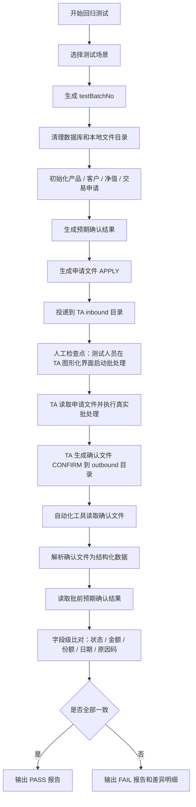

# TA 自动化测试复现：工作流教学版

## 1. 项目目标

这个项目不是实现 TA 核心系统，也不是替代 TA 批处理。它复现的是 TA 回归测试中最容易被标准化的两段：

- 批前：清理环境、准备测试数据、生成代销商申请文件、投递到 TA 输入目录。
- 批后：读取 TA 生成的确认文件，根据批前埋下的数据判断确认结果是否正确，并输出对账报告。

中间的 TA 批处理仍然由测试人员在 TA 图形化界面手动启动。这个人工检查点是设计边界，不是功能缺口。

## 2. 我们为什么做这件事

TA 场景的回归测试不是简单点页面。它依赖产品状态、客户风险有效期、交易日、净值、申请文件、确认文件和数据库结果。手工回归时，测试人员需要反复造数、放文件、跑批、找确认文件、查库、对字段，很容易漏步骤，也很依赖个人经验。

这个自动化辅助工具的价值，是把批前输入准备和批后结果校验沉淀为可重复执行的流程，帮助判断 TA 升级后核心申请确认链路是否仍然完好。

## 3. 六个核心模块

| 模块 | 负责什么 | 不负责什么 |
| --- | --- | --- |
| 场景配置模块 | 定义本次回归场景、业务日期、代销商、批次号 | 不承载 TA 业务处理 |
| 环境准备模块 | 清理本批次旧数据和本地目录，写入产品、客户、申请、预期确认 | 不修改真实生产环境 |
| 申请文件模块 | 生成 APPLY 文件并投递到 inbound 目录 | 不生成确认文件 |
| 人工跑批检查点模块 | 提示测试人员进入 TA 图形化界面启动批处理 | 不自动点击 TA 页面 |
| 确认文件校验模块 | 定位、读取、解析 TA outbound 确认文件 | 不判断 TA 内部节点是否真实通过 |
| 对账报告模块 | expected vs actual 字段级比对，输出 Markdown 报告 | 不把失败直接归因为 TA 缺陷 |

## 4. 九个核心动作

1. 选择测试场景。
2. 生成或传入 `testBatchNo`。
3. 清理数据库和本地文件目录。
4. 初始化产品、客户、交易申请和预期确认结果。
5. 生成代销商申请文件。
6. 投递申请文件到 TA inbound 目录。
7. 测试人员在 TA 图形化界面启动批处理。
8. 读取并解析 TA 生成的确认文件。
9. 比对预期结果和确认文件实际结果，生成报告。

## 5. 流程图

## 6. 工具链如何协作

| 工具 | 作用 | 在本项目中的体现 |
| --- | --- | --- |
| Jenkins | 编排整条回归流程、传入参数、保留执行记录和报告 | `Jenkinsfile` |
| Shell | 包装每一步，让 Jenkins 调用清晰 | `scripts/*.sh` |
| Java / Spring Boot CLI | 生成申请文件、解析确认文件、比对、报告 | `generate-apply` 和 `validate-confirm` |
| SQL / H2 | 模拟 Oracle 造数和校验思路 | `schema.sql` 和 repository |
| 文件目录 | 承载 TA 与代销商之间的申请/确认文件 | `data/inbound` 和 `data/outbound` |
| Markdown | 输出可归档、可面试讲解的测试报告 | `reports/*.md` |

## 7. 三条边界线

我们负责：

- 批前造数。
- 申请文件生成和投递。
- 批后确认文件解析。
- 预期与实际字段级比对。
- 测试报告输出。

TA 负责：

- 读取申请文件。
- 执行真实批处理。
- 按业务规则生成确认结果。
- 输出确认文件。

测试人员负责：

- 在 TA 图形化界面启动批处理。
- 确认批处理完成。
- 必要时查看 TA 节点、预警和错误详情。

## 8. 最大难点

第一，边界容易讲错。我们不能把自动化辅助工具讲成 TA 批处理实现。

第二，预期结果要和批前埋数保持一致。产品状态、客户风险有效期、净值、金额和业务日期必须能推导出确认结果。

第三，文件和数据库要能通过批次号、申请编号串起来。否则失败时不知道是造数错、文件错、TA 处理错，还是校验逻辑错。

第四，人工和自动化之间要有明确检查点。真实项目不是全无人值守，这一点说清楚反而更可信。
