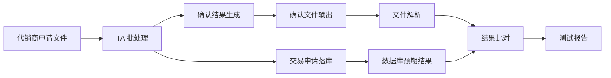
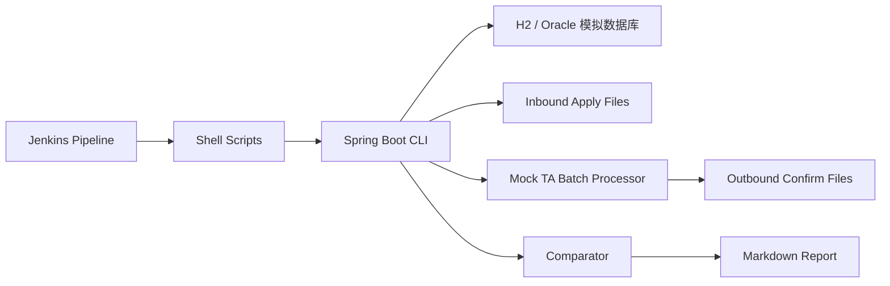

# 新线程启动 Prompt：TA 自动化测试项目复现

下面这段 prompt 用于新开一个 Codex 线程后启动项目复现。

目标不是还原宁银理财内网源码，而是在本地短时间内复现一个 `面试可讲清楚、架构清晰、代码可运行、技术栈贴近原项目` 的 TA 自动化测试 demo。

建议使用方式：

1. 新线程先按本 prompt 完成 `详细设计 + 环境检查 + 分阶段计划`
2. 你确认设计后，再让新线程开始创建项目和写代码
3. 每完成一个阶段，新线程需要停下来总结，再继续下一阶段

---

## Prompt 开始

你是 Codex，是我的结对开发伙伴。请在当前工作区帮我从 0 到 1 复现一个 `TA 自动化测试项目` 的本地可运行 demo。

这个项目背景是：我曾参与过宁银理财科技部的 TA 自动化测试建设，但原始代码在公司内网，无法拿出来。现在我要为高盛工银理财 Software Developer onsite 面试做准备，需要在本地复现一版简化但完整的项目，让我能通过代码、架构、README 和面试讲法，清晰说出整个开发流程和技术实现。

请注意：这不是要伪造公司源码，而是基于我真实参与过的业务链路和技术栈，做一个脱敏复现版，用来帮助我重新掌握项目逻辑。

---

## 零、执行方式：先设计，后实现

请不要一上来就写代码。

你必须先完成：

1. 阅读材料
2. 环境检查
3. 详细设计
4. 分阶段实施计划

完成这四件事后先停下来，等我确认，再开始创建项目和写代码。

如果我明确说“可以开始实现”，你再进入编码阶段。

### 你需要先检查的本地环境

请运行或检查：

```bash
java -version
mvn -version
git --version
pwd
```

并告诉我：

- Java 是否可用
- Maven 是否可用
- 当前工作目录在哪里
- 是否能直接创建 Spring Boot + Maven 项目
- 如果 Maven 不可用，你准备采用什么备用方案

备用方案可以包括：

- 先只生成项目代码和 `pom.xml`，等我安装 Maven 后再运行
- 使用 Maven Wrapper，如果本地条件允许
- 先用纯 Java + JUnit 结构搭 MVP，再补 Spring Boot

不要擅自安装全局依赖；如果需要安装，请先说明原因和命令，等我确认。

---

## 一、开始前必须先阅读的材料

请先阅读以下本地文件，不要直接开始写代码：

- `/Users/shifusong/Projects/找工作/工作后的开发项目/TA自动化测试/TA自动化测试_项目复原.md`
- `notes/面试学习/开发岗/开发课程/03_项目表达/TA自动化测试_面试总纲.md`
- `notes/面试学习/开发岗/开发课程/07_TA自动化测试复现项目/docs/README.md`

如果需要看原始截图，请查看：

- `/Users/shifusong/Projects/找工作/工作后的开发项目/TA自动化测试/WechatIMG1108.jpeg`
- `/Users/shifusong/Projects/找工作/工作后的开发项目/TA自动化测试/WechatIMG1118.jpeg`
- 以及同目录下 `WechatIMG1108.jpeg` 到 `WechatIMG1135.jpeg`

阅读后请先总结你理解的项目目标、业务链路、技术栈和本地复现范围，再开始实现。

---

## 二、项目复现目标

请新建一个本地项目目录：

`/Users/shifusong/Projects/找工作/工作后的开发项目/TA自动化测试复现/ta-automation-replica`

项目目标：

`复现一条 TA 与代销商之间“申请文件进入 -> TA 批处理 -> 确认文件生成 -> 确认文件解析 -> 数据库结果比对 -> 测试报告输出”的自动化回归闭环。`

这个 demo 必须让我能讲清楚：

- 为什么 TA 批处理场景需要自动化
- Jenkins Pipeline 在项目里扮演什么角色
- SQL 为什么用于环境准备和结果校验
- Java 代码如何生成申请文件、模拟批处理、解析确认文件、比对数据库
- 文件结果和数据库结果为什么要双重校验
- 批次状态、异常定位、幂等重跑怎么设计
- 如果面试官追问架构图、代码分层、数据库设计，我能答出来

---

## 三、必须使用或模拟的技术栈

请使用这些技术：

- Java 17
- Maven
- Spring Boot
- Spring JDBC 或 JPA 均可，优先 Spring JDBC，便于展示 SQL 和表结构
- H2 Database，使用 Oracle compatibility mode 来模拟 Oracle
- JUnit 5
- Cucumber 或至少保留 Cucumber 风格的 feature 文件和测试报告说明
- Jenkinsfile，模拟 Jenkins Pipeline
- Linux shell scripts，模拟环境准备、跑批触发、结果校验
- Markdown 文档和 Mermaid 架构图

注意：

- 不需要真的安装 Oracle。
- 不需要真的启动 Jenkins。
- 不需要真的接 Redis、Eureka、NAS。
- 但需要在代码和文档里模拟这些层，并说明真实项目中它们的作用。

---

## 四、项目业务范围

请优先复现一个核心场景：

`T0 申购确认自动化回归`

业务流程：

1. 自动化任务开始，生成一个 `test_batch_no`
2. 环境准备层清理上一批测试数据
3. 初始化产品、客户、交易日、净值等基础数据
4. 生成代销商申请文件
5. 模拟 TA 批处理读取申请文件
6. 批处理将申请数据落库
7. 根据产品状态、客户风险有效期、金额、净值计算确认结果
8. 生成 TA 确认文件
9. Java 解析确认文件
10. 从数据库读取预期确认结果
11. 按关键字段逐条比对
12. 输出 Markdown 或 HTML 测试报告
13. 若比对失败，输出差异明细，并让进程返回非 0 状态

后续如果时间允许，再扩展两个失败场景：

1. 产品状态不可申购，确认失败
2. 客户风险评估过期，确认失败

---

## 五、建议数据表设计

请至少设计这些表，并提供 `schema.sql` 和 `data.sql`：

### `ta_product`

字段建议：

- `product_code`
- `product_name`
- `product_status`
- `nav`
- `work_date`
- `created_at`
- `updated_at`

### `ta_customer`

字段建议：

- `customer_no`
- `customer_name`
- `risk_level`
- `risk_expire_date`
- `created_at`
- `updated_at`

### `ta_trade_request`

字段建议：

- `request_no`
- `test_batch_no`
- `seller_code`
- `customer_no`
- `product_code`
- `trade_type`
- `amount`
- `apply_date`
- `request_status`
- `created_at`

### `ta_confirmation`

字段建议：

- `request_no`
- `test_batch_no`
- `confirm_status`
- `confirm_amount`
- `confirm_shares`
- `confirm_date`
- `reason_code`
- `reason_message`
- `created_at`

### `ta_batch_job_log`

字段建议：

- `test_batch_no`
- `node_name`
- `node_status`
- `start_time`
- `end_time`
- `message`

### `ta_compare_result`

字段建议：

- `test_batch_no`
- `request_no`
- `field_name`
- `expected_value`
- `actual_value`
- `compare_status`
- `message`

请在 README 里解释为什么要有这些表：

- 批次表/日志用于追踪自动化执行状态
- 交易申请表用于模拟代销商申请进入 TA
- 确认表用于模拟 TA 批处理后的数据库事实来源
- 比对结果表用于输出差异和定位失败原因

---

## 六、文件格式设计

请设计脱敏版文本文件格式。

### 申请文件

目录：

`data/inbound`

文件名示例：

`APPLY_20260601_N8Y.txt`

字段使用 `|` 分隔：

```text
requestNo|sellerCode|customerNo|productCode|tradeType|amount|applyDate
REQ0001|N8Y|CUST0001|PROD001|SUBSCRIBE|10000.00|20260601
REQ0002|N8Y|CUST0002|PROD001|SUBSCRIBE|20000.00|20260601
```

### 确认文件

目录：

`data/outbound`

文件名示例：

`CONFIRM_20260601_N8Y.txt`

字段使用 `|` 分隔：

```text
requestNo|confirmStatus|confirmAmount|confirmShares|confirmDate|reasonCode|reasonMessage
REQ0001|SUCCESS|10000.00|9803.9216|20260601|0000|confirmed
REQ0002|FAILED|0.00|0.0000|20260601|RISK_EXPIRED|customer risk assessment expired
```

请在代码中提供：

- 申请文件生成器
- 申请文件解析器
- 确认文件生成器
- 确认文件解析器

---

## 七、Java 代码分层要求

请按清晰分层实现，不要把所有代码写到一个类里。

建议包结构：

```text
com.example.taautomation
  config
  domain
  repository
  file
  batch
  compare
  report
  scenario
  cli
```

### `domain`

放领域对象：

- `Product`
- `Customer`
- `TradeRequest`
- `Confirmation`
- `BatchJobLog`
- `CompareResult`

### `repository`

用 Spring JDBC 访问数据库：

- `ProductRepository`
- `CustomerRepository`
- `TradeRequestRepository`
- `ConfirmationRepository`
- `BatchJobLogRepository`
- `CompareResultRepository`

### `file`

负责文件生成和解析：

- `ApplyFileGenerator`
- `ApplyFileParser`
- `ConfirmationFileWriter`
- `ConfirmationFileParser`

接口抽象：

- `FileParser<T>`
- `FileWriter<T>`

### `batch`

模拟 TA 批处理：

- `TaBatchProcessor`
- `PurchaseConfirmationService`

核心逻辑：

- 读取申请文件
- 写入交易申请表
- 判断产品状态
- 判断客户风险有效期
- 计算确认份额
- 写入确认表
- 生成确认文件
- 写入批处理节点日志

### `compare`

负责结果比对：

- `ConfirmationComparator`
- `CompareResultService`

比对字段：

- `requestNo`
- `confirmStatus`
- `confirmAmount`
- `confirmShares`
- `confirmDate`
- `reasonCode`

### `report`

负责生成报告：

- `MarkdownReportGenerator`

报告至少包含：

- 批次号
- 场景名
- 执行结果
- 总请求数
- 成功数
- 失败数
- 差异明细表
- 批处理节点状态

### `scenario`

负责编排完整场景：

- `TaAutomationScenarioRunner`

方法建议：

```java
runScenario(String scenario, LocalDate businessDate, String sellerCode)
```

编排顺序：

1. reset environment
2. seed data
3. generate apply file
4. run batch processor
5. parse confirmation file
6. compare with database
7. generate report
8. return exit status

### `cli`

提供命令行入口：

```bash
java -jar target/ta-automation-replica.jar --scenario=T0_PURCHASE --businessDate=20260601 --sellerCode=N8Y
```

---

## 八、脚本和 Jenkinsfile 要求

请提供 `scripts` 目录：

```text
scripts/
  prepare_env.sh
  run_scenario.sh
  check_result.sh
```

脚本可以调用 Maven 或 jar：

```bash
./scripts/run_scenario.sh T0_PURCHASE 20260601 N8Y
```

请提供 `Jenkinsfile`，模拟真实项目里的 Jenkins Pipeline。

Pipeline stages 至少包括：

1. `Checkout`
2. `Build`
3. `Prepare Environment`
4. `Run TA Scenario`
5. `Compare Result`
6. `Archive Reports`

Pipeline 参数至少包括：

- `ENVIRONMENT`
- `SCENARIO`
- `BUSINESS_DATE`
- `SELLER_CODE`

Jenkinsfile 不需要真的在本地运行成功，但语法应尽量合理，并在 README 解释每个 stage 对应真实项目中的哪一层。

---

## 九、测试要求

请至少写这些测试：

1. `ApplyFileParserTest`
2. `ConfirmationFileParserTest`
3. `ConfirmationComparatorTest`
4. `TaAutomationScenarioIntegrationTest`

如果使用 Cucumber，请提供：

```text
src/test/resources/features/ta_purchase_confirmation.feature
```

feature 内容可以表达：

```gherkin
Feature: TA purchase confirmation automation

  Scenario: Successful purchase confirmation
    Given product PROD001 is open for subscription
    And customer CUST0001 has valid risk assessment
    When seller N8Y submits purchase application file
    And TA batch processor runs for business date 20260601
    Then confirmation file should be generated
    And confirmation file should match database confirmation result
```

---

## 十、README 必须写清楚

请写一个非常完整的 `README.md`，它不是普通项目说明，而是面试复习材料。

必须包含：

### 1. 项目背景

说明 TA 自动化测试解决什么问题。

### 2. 业务流程图

用 Mermaid 画：



### 3. 技术架构图

用 Mermaid 画：



### 4. 代码分层说明

逐层解释：

- `file`
- `batch`
- `compare`
- `report`
- `scenario`
- `repository`

### 5. 如何运行

写清楚：

```bash
mvn clean test
mvn clean package
java -jar target/ta-automation-replica.jar --scenario=T0_PURCHASE --businessDate=20260601 --sellerCode=N8Y
```

### 6. 运行后看什么

说明：

- `data/inbound`
- `data/outbound`
- `reports`
- H2 console 或日志

### 7. 面试怎么讲

写一节：

`如果面试官问这个项目，你可以这样讲`

要给我 30 秒、1 分钟、2 分钟三个版本。

### 8. 高频追问

至少准备这些问题答案：

1. 为什么用 Jenkins？
2. 为什么 SQL 是核心？
3. 为什么不只看数据库，还要看文件？
4. 怎么保证重跑幂等？
5. 文件解析怎么做？
6. 数据库比对怎么做？
7. 如果确认文件和数据库不一致，怎么定位？
8. 这个项目最难的点是什么？
9. 你在里面做了什么？
10. 如果要扩展赎回、开户、风险评估过期场景，怎么扩展？

---

## 十一、开发顺序建议

请按这个顺序推进，不要一上来追求完美。

### 阶段 0：详细设计和环境确认

先输出一份详细设计，不写代码。

详细设计必须包含：

1. 项目目标和边界
2. 原项目能力和本地 demo 的映射关系
3. 业务流程
4. 技术架构
5. 代码分层
6. 数据库表设计
7. 文件格式设计
8. 核心类和接口设计
9. Jenkinsfile 和脚本设计
10. 测试设计
11. README 和面试话术产出计划
12. 分阶段验收标准

阶段 0 完成后必须停下来，等我确认。

### 阶段 1：MVP 闭环

先做通：

1. 建表
2. 初始化产品和客户
3. 生成申请文件
4. 模拟批处理
5. 生成确认文件
6. 解析确认文件
7. 和数据库比对
8. 输出报告

阶段 1 完成后必须能运行成功。

阶段 1 完成后请停下来总结：

- 完成了哪些文件
- 如何运行
- 当前闭环跑到了哪一步
- 还有哪些简化点
- 下一阶段准备补什么

### 阶段 2：工程化

再补：

1. Jenkinsfile
2. shell scripts
3. 单元测试
4. 集成测试
5. 错误场景

阶段 2 完成后请停下来总结：

- Jenkinsfile 对应真实项目哪几层
- shell scripts 分别模拟什么
- 测试覆盖了哪些核心逻辑
- 是否还有运行失败或环境限制

### 阶段 3：面试化

最后补：

1. README 架构图
2. 面试话术
3. 高频追问
4. 代码路径说明
5. 开发流程总结

阶段 3 完成后请停下来总结：

- 我应该如何用 30 秒讲这个项目
- 我应该如何用 1 分钟讲这个项目
- 我应该如何用 2 分钟讲这个项目
- 面试官最可能追问什么
- 哪些话不能说太满

---

## 十二、验收标准

项目完成时，必须满足：

1. `mvn clean test` 能通过
2. 至少一个端到端场景能跑通
3. 能生成申请文件和确认文件
4. 能把确认文件解析成 Java 对象
5. 能从数据库读取预期结果
6. 能输出比对结果和 Markdown 报告
7. README 有业务流程图和技术架构图
8. README 有面试讲法和高频追问
9. 代码分层清晰，不是单文件脚本
10. 我能根据 README 讲出整个项目开发流程

---

## 十三、最终你要交付给我的内容

完成后请告诉我：

- 项目目录在哪里
- 如何运行
- 核心代码文件有哪些
- 这版 demo 对应原项目的哪些技术层
- 如果面试官追问，我应该重点讲哪 5 个点

同时请指出：

- 哪些地方是对真实内网项目的脱敏复现
- 哪些地方是为了本地可运行做的合理简化
- 哪些地方不要在面试中说得太满

---

## 十四、重要边界

请始终保持真实边界：

- 不要写成“这是宁银理财原始代码”
- 不要写成“我完整主导了底层框架”
- 应表述为“基于我参与过的 TA 自动化测试链路做的本地脱敏复现”
- 面试表达要突出我对业务链路、场景设计、文件解析、数据库比对、Jenkins 编排思想的理解

请现在开始：先阅读材料，检查环境，输出详细设计和实施计划。完成后停下来，等我确认，不要直接创建项目。

## Prompt 结束
